# 1. E-formulieren en notificeren en de Wmebv

_Auteur_\
Francesca Vonk MSc - Senior UX Designer\
Vereniging van Nederlandse Gemeenten

Versie: 1.1\
Datum: 12 december 2023

# 2. Inhoudsopgave

- [1. E-formulieren en notificeren en de Wmebv](#1-e-formulieren-en-notificeren-en-de-wmebv)
- [2. Inhoudsopgave](#2-inhoudsopgave)
- [3. Introductie](#3-introductie)
  - [3.1. Totstandkoming](#31-totstandkoming)
  - [3.2. Doel](#32-doel)
  - [3.3. Doelgroep](#33-doelgroep)
  - [3.4. Samenwerkingspartners](#34-samenwerkingspartners)
- [4. Wet Modernisering Elektronisch Bestuurlijk Verkeer](#4-wet-modernisering-elektronisch-bestuurlijk-verkeer)
  - [4.1. Wmebv samengevat in vier punten](#41-wmebv-samengevat-in-vier-punten)
  - [4.2. Wat zijn 'Formele berichten'?](#42-wat-zijn-formele-berichten)
  - [4.3. Wmebv schematisch weergegeven](#43-wmebv-schematisch-weergegeven)
- [5. Theorie: Ontwerpcriteria voor het ontwerpen en toetsen van e-formulieren en notificaties](#5-theorie-ontwerpcriteria-voor-het-ontwerpen-en-toetsen-van-e-formulieren-en-notificaties)
  - [5.1. Digitale Toegankelijkheid en Gebruikersvriendelijkheid](#51-digitale-toegankelijkheid-en-gebruikersvriendelijkheid)
  - [5.2. Rechtsgeldigheid en Authenticatie](#52-rechtsgeldigheid-en-authenticatie)
  - [5.3. Privacybescherming](#53-privacybescherming)
  - [5.4. Veiligheid](#54-veiligheid)
  - [5.5. Aanpasbaarheid en Responsiviteit](#55-aanpasbaarheid-en-responsiviteit)
  - [5.6. Duidelijke Instructies en Hulpfuncties](#56-duidelijke-instructies-en-hulpfuncties)
  - [5.7. Notificatie-Inhoud en Timing](#57-notificatie-inhoud-en-timing)
  - [5.8. Testen met gebruikers](#58-testen-met-gebruikers)
  - [5.9. Ontwerpcriteria samengevat](#59-ontwerpcriteria-samengevat)
- [6. Praktijk: Ontwikkeling van generiek e-formulier op basis van NL Design System](#6-praktijk-ontwikkeling-van-generiek-e-formulier-op-basis-van-nl-design-system)
  - [6.1. Project achtergrond en doelstelling](#61-project-achtergrond-en-doelstelling)
  - [6.2. NL Design System](#62-nl-design-system)
    - [6.2.1. Design Tokens](#621-design-tokens)
    - [6.2.2. Het Estafette model](#622-het-estafette-model)
  - [6.3. Globaal: Aanpak ontwikkeling generiek e-formulier](#63-globaal-aanpak-ontwikkeling-generiek-e-formulier)
    - [6.3.1. Samenwerking](#631-samenwerking)
    - [6.3.2. Voorbereiding](#632-voorbereiding)
    - [6.3.3. Ontwerp](#633-ontwerp)
      - [6.3.3.1. Scenario](#6331-scenario)
      - [6.3.3.2. User Journey](#6332-user-journey)
    - [6.3.4. Development](#634-development)
    - [6.3.5. Usability test](#635-usability-test)
      - [6.3.5.1. Opzet en samenstelling](#6351-opzet-en-samenstelling)
      - [6.3.5.2. Uitkomsten](#6352-uitkomsten)
  - [6.4. Specifiek: Figma ontwerpen, advies en vervolgonderzoek](#64-specifiek-figma-ontwerpen-advies-en-vervolgonderzoek)
- [7. Bronnen en overige informatie](#7-bronnen-en-overige-informatie)
  - [7.1. Stappenplan implementatie Wmebv](#71-stappenplan-implementatie-wmebv)
  - [7.2. Bronnen](#72-bronnen)
  - [7.3. Overige interessante links](#73-overige-interessante-links)
  

# 3. Introductie

## 3.1. Totstandkoming

Dit document is tot stand gekomen in opdracht van de Vereniging van Nederlandse Gemeenten Realisatie (VNGR) in samenwerking met NL Design System. Voor dit document zijn verschillende bronnen gebruikt. Naast desk-research is er een generiek e-formulier op basis van het NL Design System ontworpen en ontwikkeld. Het generieke e-formulier en de bijbehorende scenario's zijn ontwikkeld om inzage te geven in hoe enerzijds omgegaan zou kunnen worden met producten die nog niet beschikken over een e-formulier en anderzijds om te laten zien hoe met het gebruik van NL Design System binnen een relatief korte tijd gekomen kan worden tot een gebruikersvriendelijk en toegankelijk e-formulier. Het e-formulier en de bijbehorende vervolgschermen, en daarmee dus het scenario, zijn voorgelegd aan experts binnen de VNG, de werkgroepen van Wmebv en leveranciers, alsmede de Community Online Formulieren van Gebruikers Centraal en de NL Design System Community. Tevens zijn de formulieren en de flow getoetst op gebruikersvriendelijkheid en digitale toegankelijkheid door Stichting Accessibility.

## 3.2. Doel

Het doel van dit document is om inzichten te delen betreft het ontwerpen en ontwikkelen van een generiek e-formulier op basis van NL Design System zodat deze voldoet aan de wet modernisering bestuurlijk verkeer (Wmebv), digitale toegankelijkheid en de gebruikersvriendelijkheid. Tevens wordt gekeken naar wat de Wmebv betekent voor notificaties. De volgende onderwerpen worden behandeld:

- Wmebv in het kort.
- Ontwerpcriteria voor het maken van Wmebv proof e-formulieren en notificaties.
- Het ontwerpen en ontwikkelen van een generiek formulier met behulp van NL Design System voor een brede generieke inzet.
- Implementatieadviezen met betrekking tot het Wmebv proof maken van e-formulieren en notificaties.

## 3.3. Doelgroep

Dit document is bestemd voor gemeenten en leveranciers die e-formulieren ontwikkelen. Enerzijds belicht dit document handelingsperspectieven voor het inpassen van de Wmebv vereisten en anderzijds voor het maken van digitaal toegankelijke en gebruikersvriendelijke e-formulieren en notificaties.

## 3.4. Samenwerkingspartners

Dit document en de bijbehorende schermvoorbeelden zijn een samenwerking van VNGR met het NL Design System kernteam, (UX) designers uit de NL Design System Community en met name de UX-designer van Gemeente Den Haag, waar al veel onderzoek gedaan is naar de gebruikersvriendelijkheid van notificaties. Tevens is het werk voorgelegd aan experts binnen de VNG, de werkgroepen van Wmebv en leveranciers, alsmede de Community Online Formulieren van Gebruikers Centraal. In een vervolgstap wordt graag samengewerkt met een nog bredere groep gemeenten en leveranciers om een nog groter draagvlak te creëren voor het inzetten van generieke componenten en interactiepatronen van NL Design System.

# 4. Wet Modernisering Elektronisch Bestuurlijk Verkeer

In de Handreiking van Het Ministerie van Binnenlandse Zaken in samenwerking met Logius wordt het doel van deze wet helder benoemd:

> De regering wil in het kader van de digitaal werkende overheid komen tot de implementatie van het wetsvoorstel modernisering elektronisch bestuurlijk verkeer. Met name de huidige regel dat een bestuursorgaan verkeer via de elektronische weg moet toestaan en dus ook kan uitsluiten, wordt als verouderd ervaren. Kabinetsbeleid is daarom dat bedrijven en burgers zaken die ze met de overheid doen – zoals het aanvragen van een vergunning – digitaal moeten kunnen afhandelen. Elektronisch bestuurlijk verkeer kan bijdragen aan de vermindering van administratieve lasten van burgers en bestuurlijke lasten van bestuursorganen. De wet neemt belemmeringen weg en stelt enkele randvoorwaarden aan de modernisering en digitalisering van de werkprocessen binnen de publieke sector. Burgers en bedrijven krijgen het recht (niet de plicht) om ieder formeel bericht elektronisch aan de overheid te zenden. Bij gebruik van de elektronische weg gelden er nieuwe waarborgen, waardoor nog meer rechtsbescherming wordt gerealiseerd. Tegelijkertijd houden bestuursorganen ruimte om digitale processen af te stemmen op de eigen organisatie. Om een compacte, efficiënte overheid te realiseren met hoogwaardige dienstverlening, is digitalisering een vereiste en is het digitale kanaal het voorkeurskanaal. Het uitgangspunt is: digitaal waar het kan. Het doel van de Wmebv is om regels over elektronisch bestuurlijk verkeer te moderniseren en burgers en bedrijven het recht te geven om elektronisch zaken te doen met de overheid. Degenen die dat willen moeten voor het digitale kanaal kunnen kiezen in hun contact met de overheid. Om te waarborgen dat iedereen met de overheid kan (blijven) communiceren, is het van belang dat communicatie langs de papieren weg mogelijk blijft. En dat de provincie een inclusief beleid voor ondersteuning van bepaalde doelgroepen gaat uitvoeren.

Bron: [Handreiking implementatie Wet modernisering elektronisch bestuurlijk verkeer (Awb) 2023.](https://www.digitaleoverheid.nl/wp-content/uploads/sites/8/2017/04/Handreiking-implementatie-Wet-modernisering-elektronisch-bestuurlijk-verkeer-2023.pdf)

## 4.1. Wmebv samengevat in vier punten

De Wmebv is een belangrijk element in de bredere digitale transformatie van overheidsdiensten in Nederland en het is ontworpen om de overgang naar een meer digitaal georiënteerd bestuurlijk verkeer te vergemakkelijken.

- Wmebv is een wijziging van de Algemene Wet Bestuursrecht.
- Wmebv geeft het recht op digitaal communiceren met bestuursorganen voor éen ieder'(waaronder burgers en bedrijven).
- Wmebv stelt het openstellen van digitale kanalen verplicht, voor ieder formeel bestuurlijk bericht gericht aan het bestuursorgaan.
- Wmebv resulteert zo nodig in het aanpassen van digitale kanalen zodat het aan de wettelijk gestelde eisen voldoet.

## 4.2. Wat zijn 'Formele berichten'?

Voordat er iets dieper ingegaan wordt op de Wmebv, is het belangrijk om aan te geven om wat voor berichtenverkeer het gaat in de Wmebv. In de diverse documentatie betreffende de Wmebv wordt op verschillende manieren gerefereerd naar het 'Elektronisch Bestuurlijk Verkeer'. Dit verkeer, in de vorm van digitale berichten, wordt in diverse documentatie ook wel 'Officiële berichten', 'Formele berichten' en 'Formeel officiële berichten' genoemd. In alle gevallen wordt hetzelfde bedoeld. In dit document wordt de term 'formele berichten' aangehouden. Met het 'elektronisch bestuurlijk verkeer' worden dus de 'formele berichten' bedoeld en deze verwijzen doorgaans naar officiële communicatie in het kader van de uitvoering van publieke taak door de overheid. Deze berichten bevatten vaak belangrijke mededelingen, beslissingen, of andere informatie van juridische of bestuurlijke aard. Enkele veelvoorkomende voorbeelden:

- Berichten die deel uit maken van een procedure of besluit (zoals bijvoorbeeld: een aanvraag, zienswijze, ingebrekestelling of bezwaarschrift).
- Een klacht.
- Een anders krachtens wettelijk voorschrift voorgeschreven bericht. Bijvoorbeeld een melding.

Niet-officieel bestuurlijke berichten zijn alle andere berichten zoals informele contacten.

Het exacte bereik en de aard van formele berichten kunnen sterk variëren, dus is het belangrijk om de specifieke wetgeving en bestuurlijke structuren in overweging te nemen om een vollediger beeld te krijgen van welke producten onder deze term vallen. Voor dit document is het echter van belang het verschil tussen niet formele berichten en formele berichten aan te duiden, om zo duidelijk te maken dat de Wmebv niet voor alle processen/producten geldt maar enkel voor de formele berichten. Voor meer verdieping in de juridische aspecten wordt verwezen naar de video-opname van [Kennissessie 1:  Juridisch Aspecten](https://youtu.be/7Vujk18JA-g) van 9 oktober 2023 en de technischere
[kennissessie 6: Digitale interactie over onder andere Generieke services](https://www.youtube.com/watch?v=m2x146aH9YM) van 7 november 2023 die beiden te vinden zijn op de website: [VNG webinars en kennissessies](https://vng.nl/wmebv-webinars-en-kennissessies).

## 4.3. Wmebv schematisch weergegeven

Om toch een idee te geven van de strekking van de Wmebv, wat veel verder strekt dan enkel e-formulieren en notificaties, worden de belangrijkste aspecten op een rij gezet.
Zie voor een zeer uitgebreide toelichting op de Wmebv ook de [Handreiking implementatie Wet modernisering elektronisch bestuurlijk verkeer (Awb) 2023.](https://www.digitaleoverheid.nl/wp-content/uploads/sites/8/2017/04/Handreiking-implementatie-Wet-modernisering-elektronisch-bestuurlijk-verkeer-2023.pdf) van het Ministerie van Binnenlandse Zaken.

Allereerst is het belangrijk om te weten dat de Wmebv over processen of beter gezegd, communicatiestromen gaat. Communicatiestromen tussen burger en overheidsinstantie. De stroom van een formeel bericht kent een begin en een eind. De stroom verloopt in verschillende fasen. Een formeel bericht wordt geïnitieerd (zie het schema: 'Voor ontvangst') en vervolgens verstuurd. Als het goed gaat, wordt het bericht ontvangen door de overheidsinstantie (zie het schema: 'Na ontvangst'). Vervolgens wordt het bericht in behandeling genomen en tijdens de behandeling kunnen vervolgacties voor de burger of instantie voortvloeien. Deze acties worden uitgevoerd, gelogd en er wordt over gecommuniceerd (zie het schema: 'Uitgaande formele berichten'), net zolang tot de behandeling van de initiële vraag of de daaruit voortgevloeide vragen of acties afgehandeld zijn. Naast de ze digitale communicatiestroom van formele berichten tussen burger en instantie, regelt de Wmebv een zorgplicht die stelt dat er voor passende ondersteuning gezorgd moet worden voor de mensen die minder goed mee kunnen komen in de digitale wereld.\
\
Afbeelding: Schematische weergave Wmebv

De aspecten van de Wmebv zijn op te delen in onder andere een aantal blokken met daarin fasen waarin een formeel bericht zich bevindt:

**Blok 1 - Binnenkomende formele berichten:**\
Dit blok is onder te verdelen in twee fasen:

**Fase 1 - Voor ontvangst:**\
Een formeel bericht kan op verschillende manieren binnenkomen, afhankelijk van het gekozen/aangeboden digitale kanaal. Denk aan:

- Een generiek contactformulier met upload mogelijkheid. Later in dit document wordt een voorbeeld behandeld van een generiek formulier.
- E-mailkanaal. Echter, de meningen zijn nog verdeeld over hoe veilig dit medium is.
- Specifiek webformulier met DigiD / e-Herkenning.
- Via een MijnOmgeving.
- Via een Berichtenbox, bijvoorbeeld MijnOverheid.

De Wmebv regelt dat instanties de wijze van indienen bekend maken door kanalen aan te wijzen en dit bijvoorbeeld vast te leggen in een aanwijzingsbesluit en de burgers te informeren over het aangewezen digitale kanaal.
Er zijn een aantal belangrijke punten voordat een officieel bericht ontvangen kan worden:

- De digitale weg moet veilig zijn. Belastende of onveilige berichten worden geweigerd.
- Er mogen geen technische eisen gesteld worden die onnodig belemmerend zijn.
- Er mogen geen gegevens afgedwongen worden zonder grondslag. Alleen noodzakelijke gegevens mogen worden uitgevraagd. Dit is alleen anders als bij de uitvraag wordt vermeld dat de verstrekking van de niet-noodzakelijke gegevens niet verplicht is.
- De gemeente heeft de bevoegdheid tot het verlengen van de indieningstermijn bij storing en dient dit bekend te maken op bijvoorbeeld de website.

**Fase 2 - Na ontvangst:**\
De Wmebv regelt dat er ontvangstbevestiging verstuurd moet worden. Indien berichten intern doorgeleid zijn of afgewezen zijn, dient dit medegedeeld te worden.

Intern doorgeleiden is verplicht als:

- het bericht zonder nadere bewerking behandeld kan worden;
- het bezwaarschrift of beroepschrift is;
- voor het type bericht geen wijze van verzending is aangewezen;

De aanvang van de wettelijke behandeltermijn schuift op naar tijdstip van het intern doorgeleiden. Daarbij moet het bestuursorgaan de afzender wel meteen mededelingen doen van het doorgeleiden en het tijdstip waarop de termijn aanvangt.

De Wmebv regelt ook dat indien een bericht verkeerd is ingezonden, en om die reden is afgewezen, dat er een mededeling aan de afzender gezonden moet worden waarin vermeld wordt wat de juiste wijze van indiening is.

De Wmebv regelt dat ingevulde gegevens van een e-formulier terug-getoond moeten worden. Hetzij via:

- een download mogelijkheid tijdens het aanvraagproces;
- inzage via een MijnOmgeving;
- het toezenden van het afschrift.

**Wmebv-ontwerpadvies:**\
Denk bij het ontwerpen van deze communicatie aan de hierboven genoemde punten. Bijvoorbeeld op deze manier:\
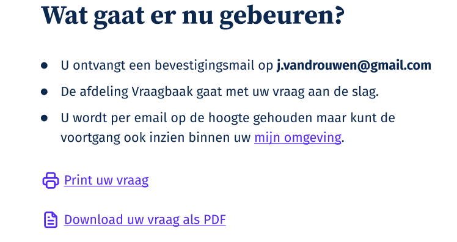\
Afbeelding: Mogelijkheid tot printen en downloaden.

Tot slot kan de gemeente bewijslast hebben, dat betekent dat er een systeem moet zijn waarin gegevens gelogd worden.

**Blok 2 - Uitgaande formele berichten:**\
Dit blok is niet verder onderverdeeld in fasen. Bij dit blok geld dat de Wmebv regelt dat als er genotificeerd wordt (nl. 'bij plaatsing van een bericht in een systeem voor gegevensverwerking waarin de geadresseerde toegang heeft tot het bericht'), dat er met een aantal zaken rekening gehouden moeten worden. Namelijk:

- De afzender moet worden vermeld.
- De aard van het bericht moet worden vermeld (Bijv. ontvangstbevestiging, beschikking, betalingsverplichting etc.).
- Een reactietermijn moet worden vermeld voor zover dat aan de orde is.
- Indien een notificatie niet bezorgd kan worden door een tijdelijk probleem (een 'soft bounce') dan moet deze minimaal eenmaal opnieuw verzonden worden.
- De gemeente heeft een inspanningsverplichting om de geadresseerde langs een andere weg te informeren over het niet kunnen bezorgen van notificaties als deze door een permanent probleem ('hard bounce') niet kunnen worden bezorgd.

Note: Het is belangrijk te weten dat er (in de documentatie) over de Wmebv gesproken wordt over 'Berichten' en 'Notificaties'. Met een 'Notificatie' wordt de burger of het bedrijf op de hoogte gesteld dat er een 'Bericht' beschikbaar is. Denk bijvoorbeeld aan de 'e-mail notificatie':
>Geachte J. van Drouwen,\
Er staat document in uw Berichtenbox van RDW. Log in op MijnOverheid om het bericht te bekijken.
Mogelijk moet u naar aanleiding van dit bericht actie ondernemen. Lees het daarom op tijd.\
Met vriendelijke groet,\
MijnOverheid

Het 'bericht in de Berichtenbox' zelf bevat dan de inhoud, bijvoorbeeld:
> Herinnering APK\
> \
> Datum: 09 oktober 2022 16:20\
> Afzender: RDW\
> Referentie: \[kenteken\]\
> Postvak: Inbox\
> \
> Geachte heer/mevrouw,
>
> Uw voertuig is toe aan de Algemene Periodieke Keuring, kortweg APK. In de bijlage van deze e-mail kunt u lezen voor welke datum uw voertuig APK-goedgekeurd moet zijn\
> \
> Met vriendelijke groet,\
> RDW

In het volgende hoofdstuk wordt nog iets dieper ingegaan op notificaties.

**Wmebv-ontwerpadvies:**\
Denk bij het ontwerpen van deze communicatie aan de hierboven genoemde punten. Voor meer gedetailleerde informatie over notificaties wordt verwezen naar [de bijdrage over notificatie en Wmebv door Logius.](https://www.logius.nl/domeinen/interactie/mijnoverheid/wet-modernisering-elektronisch-bestuurlijk-verkeer) Waar onder andere toelichting gegeven wordt op de nieuwe notificatie templates die door hen ontwikkeld zijn. Het meest recente UX onderzoek naar communicatie templates vond plaats in oktober 2023. Ook worden nieuwe technische mogelijkheden zoals een nieuwe variabele voor een 'einddatum handelingstermijn' in meer detail besproken.

De gemeente heeft tevens een bewijslast en moet het volgende kunnen bewijzen:

- Het tijdstip van verzending of ontvangst.
- De verzending met de samenhangende ontvangstbevestiging of notificatie.
- Tijdstip inlog geadresseerde om kennis te nemen van een aan hem gezonden bericht.
- Ontvangen meldingen van formele berichten die niet konden worden bezorgd.

Voor meer verdieping in de juridische aspecten wordt verwezen naar de video-opname van Kennissessie 1:  Juridisch Aspecten genoemd in paragraaf [4.2](#42-wat-zijn-formele-berichten).

**Blok 3 - Zorgplicht:**\
Tot slot staat  in het schema de zorgplicht genoemd.
De Wmebv regelt tevens een zorgplicht voor passende ondersteuning bij communicatie.
Denk hierbij aan:

- Passende ondersteuning is afgestemd op de doelgroepen en hun vaardigheden (lezen, schrijven, omgaan met digitale apparaten).
- Passende ondersteuning is generiek (zoals informatie op een website) en persoonlijk (zoals hulp aan de telefoon of balie).
- Bij passende ondersteuning is maatwerk niet verplicht.
- Beleid over passende ondersteuning opstellen en publiceren op de website (bijvoorbeeld regels of een, uiteraard toegankelijke, handreiking).

Voor een uitgebreide toelichting op de Zorgplicht wordt verwezen naar de video-opname van 11 oktober 2023, [Kennissessie 3: Zorgplicht](https://vng.nl/wmebv-webinars-en-kennissessies).

# 5. Theorie: Ontwerpcriteria voor het ontwerpen en toetsen van e-formulieren en notificaties

Bij het toetsen van formulieren en notificaties Wmebv is het van belang om te zorgen dat deze voldoen aan de eisen van de wet, met een focus op digitale toegankelijkheid en gebruiksvriendelijkheid. Hier zijn enkele specifieke punten waaraan aandacht besteed zou moeten worden:

## 5.1. Digitale Toegankelijkheid en Gebruikersvriendelijkheid

Zorg ervoor dat formulieren en notificaties voldoen aan de normen voor [digitale toegankelijkheid](https://digitaaltoegankelijk.nl/over-digitale-toegankelijkheid/?gad_source=1&gclid=CjwKCAiAu9yqBhBmEiwAHTx5pwysW_wLxGEtgB5WBIudRJTs5oxdsWq63pcDaPVHx0wiFQwHvbKfQRoCnssQAvD_BwE), zoals vastgesteld in de [Web Content Accessibility Guidelines (WCAG)](https://www.w3.org/WAI/standards-guidelines/wcag/). De meest voor de hand liggende punten om rekening mee te houden:

- De **structuur** van het formulier zowel in de frontend als de backend moet goed in elkaar zitten, vermijd, indien mogelijk, een horizontale layout en zorg ervoor dat de labels en velden aan elkaar gekoppeld zijn in de code. Voorzie alle invulvelden van een label en stapel de velden het liefst. Note: Hoewel een horizontale layout geen WCAG criterium is, biedt deze wel toegankelijkheidsvoordelen. Denk bijvoorbeeld aan mensen met kokervisie, die met een gestapelde layout makkelijker het formulier van boven naar beneden kunnen lezen.
  
  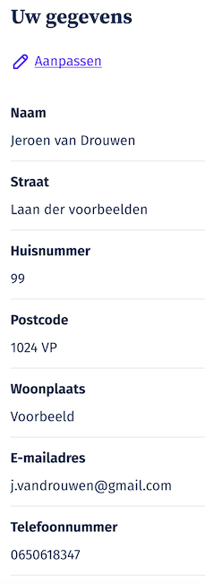\
  Afbeelding: Gestapelde labels en velden.

  **Advies onderzoeksvraag:**\
  Wordt het formulier met een screen reader in de juiste volgorde voorgelezen?
  

- Maak **foutmeldingen** visueel en tekstueel duidelijk, dit is een van de WCAG normen. Om het gebruikersvriendelijk te maken is het fijn om de gebruiker naar de plek waar de fout opgelost moet worden te leiden.
  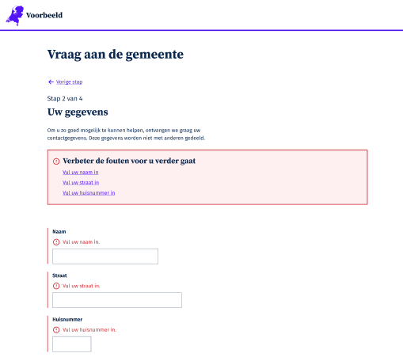\
  Afbeelding: Foutmeldingen in een e-formulier
  
  **Advies onderzoeksvraag:**\
  Kunnen gebruikers met diverse niveaus van geletterdheid en visueel, auditieve en fysieke beperkingen, zonder in de stress te raken, de fouten in het formulier vinden en oplossen?

- Zorg ervoor dat formulieren met het toetsenbord bediend kunnen worden, dit is een [WCAG criterium](https://www.w3.org/WAI/WCAG22/quickref/?versions=2.1#keyboard).
- Houd rekening met tijdslimieten waarin een formulier ingevuld moet worden, niet iedereen kan dit in een vergelijkbaar tempo. Dit is  eveneens een [WCAG criterium](https://www.w3.org/WAI/WCAG22/quickref/?versions=2.1#timing-adjustable).
  
  **Advies onderzoeksvraag:**\
   Kunnen gebruikers met diverse niveaus van geletterdheid en visueel, auditieve en fysieke beperkingen, zonder muis en met een toetsenbord eenvoudig door het formulier navigeren binnen een eventueel gestelde tijd?

- Vertrouw niet alleen op kleur en zorg voor leesbare [tekst op B1 niveau](https://ishetb1.nl/). Dit is geen WCAG criterium maar wel goed voor de toegankelijkheid. [Test het formulier en de website op het kleurcontrast](https://www.toptal.com/designers/colorfilter) in verband met de vele vormen en gradaties van kleurenblindheid.\
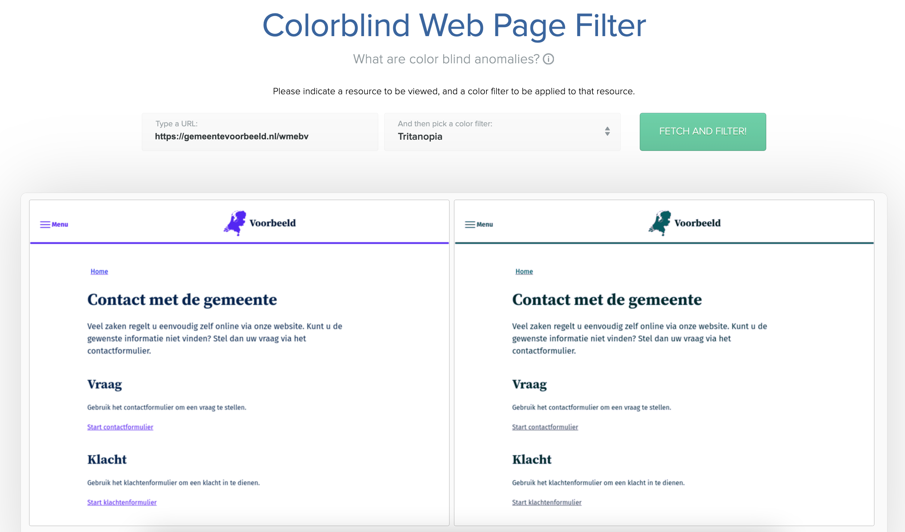\
Afbeelding: Screenshot van kleurenfilter test.\
Bron: [https://www.toptal.com](https://www.toptal.com)

Naast toegankelijke formulieren is het ook belangrijk de eventuele bijlagen in de vorm van documenten digitaal toegankelijk te maken. Zoals digitaal toegankelijke pdf's of afbeeldingen die voor mensen die blind of slechtziend zijn niet te ontcijferen zijn.

- Overweeg om in plaats van pdf's, toegankelijke HTML te gebruiken indien de inhoud enkel bekeken dient te worden.
- Overweeg om [OpenDocument](https://opendocumentformat.org/guidance/accessibility/) te gebruiken voor pdf-formulieren die aanpasbaar moeten zijn.
- Als er toch pdf gebruikt moet worden, zorg ervoor dat [pdf's zo digitaal toegankelijk mogelijk](https://accessible-pdf.info/en/basics/) zijn en overweeg dan een digitaal toegankelijke versie van de inhoud, in bijvoorbeeld HTML, ernaast aan te bieden.
- Onthoud dat het makkelijker is om digitaal toegankelijke HTML of OpenDocument te maken dan een digitaal toegankelijke pdf.
  
Zorg ervoor dat de taal eenvoudig en duidelijk is en dat gebruikers gemakkelijk door het formulier of de notificatie kunnen navigeren. Voor meer informatie wordt verwezen naar [de aanbevolen richtlijnen voor taalgebruik](https://www.communicatierijk.nl/vakkennis/rijkswebsites/aanbevolen-richtlijnen/taalniveau-b1) van Dienst Publiek en Communicatie van het Ministerie van Algemene Zaken.

- Vul invulvelden, waar mogelijk, vooraf in.
- Geef voorwaarden, uitleg, benodigde informatie en documenten aan.
- Gebruik duidelijke taal en begrippen.
- Licht vragen en termen toe, waar nodig.
- Test de formulieren en notificaties op algemene gebruiksvriendelijkheid. Zijn ze intuïtief en gemakkelijk te begrijpen voor de gebruiker?

Note: NL Design System werkt ten tijde van dit schrijven, aan vernieuwde richtlijnen voor e-formulieren, naar verwachting zijn deze vernieuwde richtlijnen medio januari 2024 beschikbaar op de [pagina voor richtlijnen voor formulieren van NL Design System](https://nldesignsystem.nl/richtlijnen/formulieren/overzicht).

## 5.2. Rechtsgeldigheid en Authenticatie

Controleer of de gebruikte elektronische handtekeningen en authenticatiemethoden voldoen aan de [wettelijke vereisten voor rechtsgeldigheid](https://www.rijksoverheid.nl/onderwerpen/digitale-overheid/digitale-veiligheid-en-identiteit). Zorg ervoor dat er passende maatregelen zijn genomen om de identiteit van de gebruiker te verifiëren.

## 5.3. Privacybescherming

Wees alert op privacy kwesties bij het verzamelen en verwerken van persoonsgegevens. Zorg ervoor dat de formulieren en notificaties voldoen aan de Algemene Verordening Gegevensbescherming (AVG) en andere relevante privacywetgeving. Raadpleeg hiervoor de [uitgebreide informatie over privacybescherming](https://www.rijksoverheid.nl/onderwerpen/privacy-en-persoonsgegevens)  op de website van de Rijksoverheid.

## 5.4. Veiligheid

Controleer of er voldoende [beveiligingsmaatregelen](https://www.cip-overheid.nl/) zijn genomen, met name bij het verzenden van gevoelige informatie. Beveiligde verbindingen (HTTPS) en versleuteling van gegevens zijn hierbij belangrijk.

## 5.5. Aanpasbaarheid en Responsiviteit

Zorg ervoor dat formulieren en notificaties goed werken op verschillende apparaten en schermformaten. Zorg ervoor dat de formulieren ook goed werken op mobiele apparaten zoals telefoons en tablets. Houd hierbij extra rekening met het aanbieden van het [juiste mobiele toetsenbord](https://www.mobilespoon.net/2018/12/10-usability-rules-keyboard-mobile-app.html) per type invoerveld. De standaard toetsenbord indeling (meestal de Qwerty-indeling) bij tekstvelden, nummerriek bij nummervelden etc. Uit het recent uitgevoerde usability onderzoek, dat verderop in dit document wordt toegelicht, kwam naar voren dat het merendeel van de participanten gebruikmaken van hun mobiele telefoon of tablet om dergelijke formulieren in te vullen. Daarbij zijn ze vaak geholpen met de woordsuggesties die het mobiele apparaat toont, om zo sneller een tekst te kunnen produceren.\
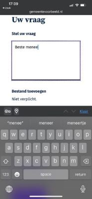\
Afbeelding: Mobiel toetsenbord met woordvoorspelling mogelijkheid.

Responsiviteit of adaptiviteit is essentieel voor een goede gebruikerservaring op zowel desktops als mobiele apparaten. Hierbij [een interessant artikel over het verschil tussen Responsive en Adaptive ontwerp.](https://www.uxpin.com/studio/blog/responsive-vs-adaptive-design-whats-best-choice-designers/)

## 5.6. Duidelijke Instructies en Hulpfuncties

Bied duidelijke instructies bij het invullen van formulieren en zorg voor eventuele hulpfuncties indien nodig. Gebruikers moeten gemakkelijk de benodigde informatie kunnen vinden en begrijpen hoe ze het formulier moeten invullen. Nielsen Norman Group schreef een [helder artikel over Help en Documentation.](https://www.nngroup.com/articles/help-and-documentation/)

## 5.7. Notificatie-Inhoud en Timing

Bij notificaties is het belangrijk dat de inhoud relevant, begrijpelijk en tijdig is. Vermijd overbodige informatie en zorg ervoor dat de notificatie op het juiste moment wordt verstuurd. Hierbij geldt voor de Wmebv dat de notificatie binnen 48 uur na plaatsing van het formele bericht in het systeem voor gegevensverwerking aan de geadresseerde van het bericht moet worden gestuurd en dat de inhoud aan een aantal eisen moet voldoen, zoals:

- De aard en rechtsgevolg van de boodschap moet vermeld worden.
- Er moet duidelijk vermeld worden dat er een reactie van de geadresseerde verwacht wordt (bijvoorbeeld: betalen, informatie verstrekken).
- Wanneer een bericht een termijn bevat waarbinnen de geadresseerde moet reageren, moet deze termijn ook vermeld worden in de notificatie.

Dit en meer is uitgebreid terug te lezen is in de [bijdrage over notificaties en de Wmebv](https://www.logius.nl/domeinen/interactie/mijnoverheid/wet-modernisering-elektronisch-bestuurlijk-verkeer) van Logius.

## 5.8. Testen met gebruikers

Voer usability tests uit met gebruikers om inzicht te krijgen in hun ervaring en eventuele pijnpunten te identificeren. Dit kan helpen bij het verbeteren van de algehele gebruikerservaring. Goed om te weten is dat [al met vijf participanten](https://www.nngroup.com/articles/how-many-test-users/) al een groot deel van de pijnpunten aan het licht komen. Het is aan te raden gebruik te maken van instanties die gespecialiseerd zijn in het uitvoeren van usability tests.

## 5.9. Ontwerpcriteria samengevat

In de paragraaf hiervoor is uitgebreid stilgestaan bij ontwerpcriteria voor e-formulieren en notificaties waarmee in het algemeen en Wmebv specifiek rekening gehouden moet worden. Hieronder worden de punten voor het gemak nog even op een rijtje gezet. Een praktische lijst met ontwerpcriteria waarmee rekening gehouden dient te worden tijdens het ontwerp van e-formulieren en notificaties.

**Algemene e-formulier ontwerpcriteria:**

Let op, de **vetgedrukte** een met (**\*\***) gemarkeerde punten zijn ook van toepassing op de Wmebv.

1. Vul invulvelden, waar mogelijk, vooraf in.
2. Geef voorwaarden, uitleg, benodigde informatie en documenten aan.
3. **Gebruik duidelijke en eenvoudige taal en begrippen. \*\***
4. Licht vragen en termen toe, waar nodig.
5. Zorg voor toegankelijke bijlagen zoals toegankelijke pdf's of HTML.
6. **Vraag alleen noodzakelijke gegevens en informatie. \*\***
7. **Geef aan welke vragen/velden 'niet verplicht' zijn. \*\***
8. Geef foutmeldingen duidelijk en gebruikersvriendelijk aan.
9. Geef processtapen (bijvoorbeeld: stap 1 van 8) aan, wanneer uit onderzoek blijkt dat hier behoefte aan is.
10. Ondersteun de bezoeker bij het invullen en afronden, door duidelijke knoppen.
11. Zorg voor tussentijdse opslag van informatie.

**AVG-regels waar rekening mee moet worden gehouden:**

1. Wees transparant.
2. **Verzamel zo min mogelijk persoonsgegevens. \*\***
3. Vraag toestemming.
4. Gebruik eenvoudige taal.
5. **Verzend e-formulieren over versleutelde verbindingen. \*\***
6. **Registreer verwerking in verwerkingsregister. \*\***

**Wmebv e-formulier ontwerpcriteria:**\
Naast de met (\*\*) gemarkeerd punten zijn er nog twee punten die in het achterhoofd gehouden moeten worden. Op zich zijn onderstaande punten niet per se e-formulier ontwerpcriteria, echter moet er wel rekening mee gehouden worden tijdens het ontwerp van de communicatiestroom waar het e-formulier of notificatie onderdeel vanuit maakt.

1. Toon of verstuur (indien mogelijk) een ontvangstbevestiging.
2. Maak ingevulde gegevens toegankelijk voor de indiener.
3. Als toevoeging aan bovengenoemde "7. Geef aan welke vragen/velden 'niet verplicht'zijn." kan aangegeven worden dat dit ook geldt voor de Wmebv als in een formulier (toch) niet noodzakelijke gegevens uitvraagt. Zie artikel 4:4 lid 2 Awb: "In het formulier worden geen gegevens gevraagd die voor de te nemen beschikking niet noodzakelijk zijn, tenzij wordt vermeld dat de verstrekking van die gegevens niet verplicht is."

Deze lijst is onder andere geput uit de door de VNG aangeboden [Toolkit Meten en Verbeteren van Webformulieren.](https://vng.nl/kennisbank-dienstverlening-gemeenten/toolkit-meten-en-verbeteren-van-webformulieren) het [A11Y project](https://www.a11yproject.com/posts/how-to-write-accessible-forms/) en het [World Wide Web Consortium (W3C)](https://www.w3.org/WAI/standards-guidelines/wcag/).

Zoals eerder aangegeven in dit document: NL Design System werkt ten tijde van dit schrijven, aan vernieuwde richtlijnen voor e-formulieren, naar verwachting zijn deze vernieuwde richtlijnen medio januari 2024 beschikbaar op de [pagina voor richtlijnen voor formulieren van NL Design System](https://nldesignsystem.nl/richtlijnen/formulieren/overzicht).

Voor meer gedetailleerde informatie over notificaties wordt verwezen naar [de bijdrage over notificatie en Wmebv door Logius.](https://www.logius.nl/domeinen/interactie/mijnoverheid/wet-modernisering-elektronisch-bestuurlijk-verkeer) Waar onder andere toelichting gegeven wordt op de nieuwe notificatie templates die door hen ontwikkeld zijn en nieuwe technische mogelijkheden zoals een nieuwe variabele voor een 'einddatum handelingstermijn'.

# 6. Praktijk: Ontwikkeling van generiek e-formulier op basis van NL Design System

## 6.1. Project achtergrond en doelstelling

Om een praktisch voorbeeld te kunnen geven van een generiek e-formulier is er samengewerkt met NL Design System om binnen een relatief korte tijd te kunnen komen tot een generiek formulier. Waar niet alleen code van de gebruikte NL Design System componenten beschikbaar wordt gesteld, maar ook inzage geeft in het ontwerpproces en de bouw met behulp van NL Design System componenten. Er is gekozen voor het generieke formulier "Vraag aan uw gemeente", omdat dit het meest laagdrempelige formulier is wat wellicht initieel ingezet kan worden om een digitaal kanaal open te kunnen stellen. Met name voor die processen die nog niet over een (specifiek) formulier beschikken, maar die wel gecategoriseerd zijn als processen waar het berichtenverkeer geldt als formeel bericht. Het "Vraag uw gemeente" formulier kan als initieel digitale contactformulier gebruikt worden, indien er onvoldoende tijd is voordat de Wmebv van kracht gaat om een goed, veilig, digitaal toegankelijk en Wmebv-proof specifiek formulier voor bepaalde producten te kunnen ontwikkelen. Let wel, dat de behandeling van een degelijk generiek formulier omslachtiger zal zijn dan wanneer er gebruik gemaakt zou worden van bijvoorbeeld een specifiek formulier in combinatie met een achterliggend zaaksysteem, denk hierbij aan de [Omnichannel kanaalstrategie](https://vng.nl/omnichannel) en bekijken de bijbehorende kennissessie van 10 oktober 2023: [Video - Kennissessie 2: Omnichannel](https://vng.nl/wmebv-webinars-en-kennissessies).

## 6.2. NL Design System

[NL Design System](https://nldesignsystem.nl/) is een methodiek van samenwerken. NL Design System is een community van ontwerpers en ontwikkelaars met allerlei expertise, van UX-, UI-, toegankelijkheidsexperts tot programmeurs. Zij werken samen aan de totstandkoming van een grote verzameling [Open Source](https://opensource.org/definition-annotated/) componenten. Denk bijvoorbeeld aan een button, een invulveld of een combinatie van componenten die een hele pagina header vormen. Deze componenten kunnen worden voorzien van een eigen huisstijl. De componenten worden begeleid met patronen en richtlijnen. Denk bijvoorbeeld aan richtlijnen voor het ontwerpen van e-formulieren of een hele MijnOmgeving of patronen en richtlijnen voor het schrijven van toegankelijke teksten. Het werken aan het NL Design System resulteert in een steeds groter groeiende bibliotheek van digitaal toegankelijke componenten waaruit geput kan worden bij het ontwerpen en ontwikkelen van digitale overheidsproducten zoals websites en e-formulieren.

>Samen maken we de digitale dienstverlening van de overheid toegankelijk, inclusief en gebruiksvriendelijk.
>
>Een design system lijkt op basis van de naam vooral over ontwerp te gaan, maar het is eigenlijk een brede aanpak om makkelijker consistente, toegankelijke en gebruiksvriendelijke websites en applicaties te maken.
>
>Dat doet het kernteam niet alleen, maar samen met ontwerpers, ontwikkelaars, content schrijvers en andere experts uit verschillende organisaties.
>
>- Gebouwd en gebruikt door de community.
>- Platform en huisstijl onafhankelijk.
>- Uitbreidbaar en publiek beschikbaar.

Bron: website NL Design System

### 6.2.1. Design Tokens

Om de NL Design System componenten te voorzien van huisstijl wordt gebruik gemaakt van design tokens. Dit zijn ontwerpkeuzes die worden vastgelegd als data. Dit kan honderden design tokens opleveren. Uiteraard hoeven deze niet allemaal aangepast te worden, maar het geeft de mate van flexibiliteit aan. Zo zijn er globale design tokens voor de typografie, kleur en grootte. Maar ook gedetailleerde ontwerpkeuzes bijvoorbeeld voor de achtergrondkleur, omlijning of afronding van een knop. Deze design tokens samen maken een 'thema'. Hiermee zijn de componenten te voorzien van hun eigen stijl, zodat deze aansluit op de huisstijl van de organisatie. Zonder afbreuk te doen aan de digitaal toegankelijke werking ervan, mits uiteraard gehouden wordt aan de richtlijnen, denk bijvoorbeeld aan kleurcontrast, waarover werd toegelicht in paragraaf [5.1](#51-digitale-toegankelijkheid-en-gebruikersvriendelijkheid). Om nog iets dieper in te gaan op de samenwerking tussen ontwerpers en ontwikkelaars is het interessant om te weten dat met behulp van de design tool genaamd Figma in combinatie met de Token Studio plugin er een naadloze samenwerking ontstaat tussen het ontwerpen in Figma en de daadwerkelijke styling van de geprogrammeerde schermen. Waar vroeger een stijlgids overgenomen moest worden door frontend developers, kan de ontwerper nu zelf styling aandragen en updaten rechtstreeks vanuit Figma. Voor meer over deze 'magie' wordt verwezen naar een interessante [video presentatie over design tokens](https://youtu.be/n9m2TtD1esE?si=oVwolw51XTtgmt28) tijdens het jaarlijkse [Design Systems Week](https://nldesignsystem.nl/events/design-systems-week-2023/en/overview/) en de [tekstuele toelichting op design tokens](https://nldesignsystem.nl/meedoen/design-tokens/) op NL Design System. Tot slot is het interessant om te zien hoe verschillende gemeenten al hun eigen thema's beginnen op te bouwen en bijhouden in het [NL Design System Storybook](https://nl-design-system.github.io/themes/?path=/story/blockquote--gemeente-utrecht).
\
Afbeelding: Het effect op styling middels design tokens.\
Bron: website [NL Design System](https://nldesignsystem.nl/)

### 6.2.2. Het Estafette model

De NL Design System richtlijnen, patronen en componenten (vanaf nu: 'onderdelen') ontstaan vanuit de community. Als deze onderdelen worden ontworpen en ontwikkeld, bewegen ze zich door het zogenaamde ['Estafettemodel'](https://nldesignsystem.nl/meedoen/estafettemodel). Onderdelen worden tijdens hun estafettereis door de community aangedragen, ontworpen en ontwikkeld volgens de NL Design System richtlijnen om uiteindelijk de Hall of Fame status te kunnen bereiken, wat inhoudt dat een onderdeel voldoet aan de Definition of Done van NL Design System. \
Onderdelen worden tijdens hun Estafettereis Open Source gedeeld met iedereen in de community. Op [Slack (een berichten applicatie voor communities)](https://slack.com/). Tijdens de twee wekelijkse [Design Open Hour](https://nldesignsystem.nl/meedoen/als-designer/community/) en twee wekelijke [Heartbeat sessies](https://nldesignsystem.nl/project/blijf-op-de-hoogte) wordt iedereen uitgenodigd ontwerpenvraagstukken aan te dragen, ontwerpen te presenteren en/of feedback te geven. Op deze manier leert de community van elkaar en worden de componenten steeds eenduidiger verder doorontwikkeld, wat uiteindelijk resulteert in steeds groter groeiende bibliotheek van onderdelen die door iedereen gebruikt kunnen worden en wat leidt tot een eenduidig en consistente User Experience van overheidsproducten. Een mooi voorbeeld is het [GOV.UK Design System van het Verenigd Koninkrijk](https://design-system.service.gov.uk/).

## 6.3. Globaal: Aanpak ontwikkeling generiek e-formulier

### 6.3.1. Samenwerking

Voor het ontwerp en de ontwikkeling van het generieke e-formulier is er nauw samengewerkt met UX-designers, accessibility experts en developers vanuit het NL Design System kernteam en UX designers uit de NL Design system community. Met name een UX-Designer van gemeente Den Haag, die al veel ervaring heeft met het ontwerpen in [Figma](https://www.figma.com/design/) op basis van NL Design System en ook veel [onderzoek heeft gedaan naar gebruikersvriendelijkheid van generieke services](https://vng.nl/artikelen/ux-onderzoek-generieke-services) binnen de MijnOmgeving. Er heeft ten tijde van het ontwerp een grote ontwerpworkshop plaatsgevonden in de NL Design System community, Hierin werden onder andere collectieve besluiten genomen over ontwerppatronen, styling en tekst. Deze besluiten zijn doorgevoerd in de ontwerpen om deze mee te kunnen nemen in de usability test. Tevens is het ontwerp onder ander gedeeld tijdens de [Heartbeat sessie van 31 oktober 2023](https://nldesignsystem.nl/events/heartbeat/#heartbeat) van NL Design System en een e-formulieren sessie van Gebruikers Centraal.
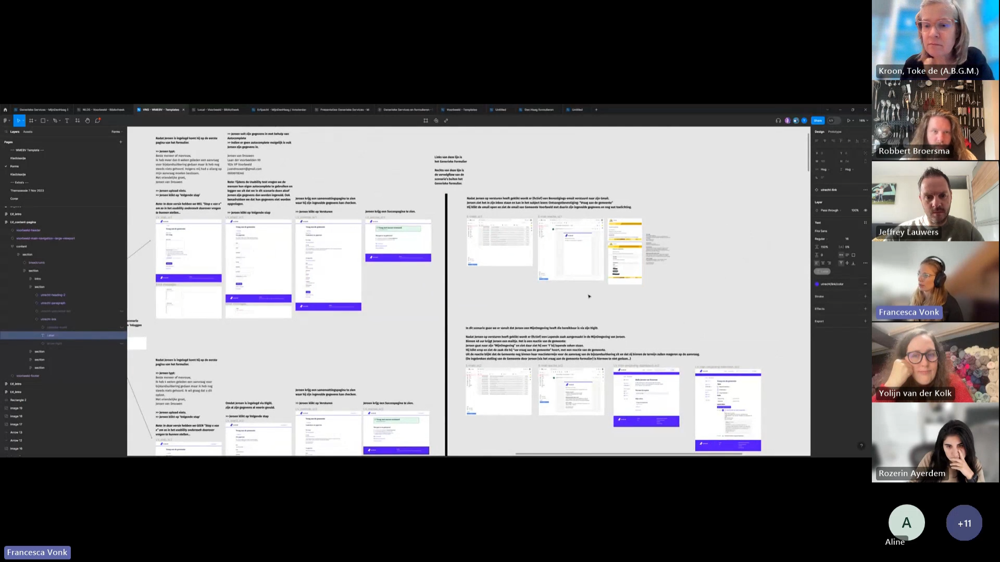
Afbeelding: Heartbeat sessie van NL Design System

### 6.3.2. Voorbereiding

Ter voorbereiding is initieel gestart met deskresearch door de ontwerper. Er zijn ontwerpcriteria verzameld en er is specifiek gekeken naar de impact van de Wmebv op deze ontwerpcriteria. Deze ontwerpcriteria zijn in [hoofdstuk 5](#5-theorie-ontwerpcriteria-voor-het-ontwerpen-en-toetsen-van-e-formulieren-en-notificaties) besproken.

Vervolgens is er onderzoek gedaan om te komen tot een prototype in Figma op basis van NL Design System. Er is besloten om het "Vraag aan uw gemeente" e-formulier inclusief de user journey wat hoort bij dit e-formulier van Gemeente Den Haag als uitgangspunt te nemen voor het generieke e-formulier omdat dit formulier ook genoemd wordt in de bijlage (pagina 72 in de footnote) over Generieke e-formulieren van het rapport over de [Implementatiepilot Wet modernisering elektronisch bestuurlijk verkeer (Wmebv)](https://vng.nl/brieven/verslag-pilots-wetsvoorstel-wet-modernisering-elektronisch-bestuurlijk-verkeer-wmebv).

### 6.3.3. Ontwerp

Voor het ontwerp is gebruik gemaakt van de NL Design System 'Voorbeeld'-bibliotheek met het violet-witte 'Voorbeeld'-thema voor Figma. Met behulp van deze bibliotheek kon er in relatief korte tijd een schermflow ontworpen worden. Het scheelt enorm veel tijd als er gebruik gemaakt wordt van de Voorbeeld-bibliotheek omdat het opzetten van een bibliotheek al is gedaan. Stel dat er voor een ander thema van de Voorbeeld-thema gekozen zou worden dan hoeven enkel de [design tokens](#621-design-tokens) voorzien te worden van het eigen thema. Voor meer informatie over hoe dit in zijn werk gaat binnen Figma wordt verwezen naar de [pagina voor designers met NL Design System](https://nldesignsystem.nl/meedoen/als-designer/overzicht).

#### 6.3.3.1. Scenario

Om de use case van dit generieke formulier te ondersteunen en te kunnen testen is nagedacht over een scenario waarin dit formulier gebruikt zou kunnen worden. Om het scenario aan te laten sluiten bij op de Wmebv, is in overleg met een jurist gekomen tot een situatie waarbij de fictieve burger (een persona) Jeroen van Drouwen de gemeente waarin hij woonachtig is (Gemeente Voorbeeld) in gebreke stelt. Het in gebreke stellen heeft een juridisch gevolg, dus valt deze 'vraag aan de gemeente' in de categorie 'Formele berichten' en is de Wmebv dus van toepassing.

#### 6.3.3.2. User Journey

Om te komen tot een prototype schermflow, is een user journey uitgewerkt en uitgebreid besproken in de NL Design System community. De bijbehorende Figma schermen van deze user journey worden in de volgende paragraaf getoond en zijn eveneens beschikbaar in de [VNG Wmebv Figma omgeving](https://www.figma.com/proto/iIr1gkAR3oZ0UFWKIni8Nv/VNG---WMEBV---Templates?page-id=1783%3A7195&type=design&node-id=1783-13018&viewport=2044%2C220%2C0.06&t=ZgGyDyuCmc73YbAh-1&scaling=min-zoom&starting-point-node-id=1783%3A13018&mode=design).

\
Afbeelding: Schematische weergave van de user journey.

A. De contact-pagina.\
Jeroen van Drouwen heeft een 8 weken geleden een Bijstandsuitkering aangevraagd en nog geen reactie gehad van de Gemeente. Jeroen vindt dit niet leuk en denkt dat de gemeente inmiddels al te laat is met reageren en besluit een vraag aan de gemeente hierover te willen stellen. Jeroen komt via de Homepage van Gemeente Voorbeeld op de Contactpagina uit. Hier kan hij kiezen wat hij wil doen. Jeroen besluit een Vraag te willen stellen en start het Contactformulier.

B Het intro-scherm van het contact-formulier.\
Jeroen komt op de intro-pagina van het ‘Vraag aan de gemeente’-formulier uit. Daar kan hij een aantal punten lezen. Hoelang het formulier ongeveer duurt, dat hij verplichte en optionele velden kan aantreffen, dat hij het tussentijds kan opslaan en later verder gaan en dat er een bevestiging-email gestuurd gaat worden. Tot slot kan hij lezen dat het ingevulde formulier gedownload en geprint kan worden. Jeroen klikt op 'Doorgaan'.

C. De pagina met de keuze om in te loggen met Digid ja of nee?\
Vervolgens moet Jeroen een keuze maken. Wil hij inloggen of niet? Beide paden worden ondersteund in het ontwerp en in de uiteindelijke ontwikkeling. Echter, het DigiD-gedeelte wordt overgeslagen omdat dit buiten de scope van dit project ligt.

D. De Digid inlog pagina.\
Indien Jeroen ervoor kiest om in te loggen, zal er een zeer eenvoudig scherm verschijnen met de tekst "Doe alsof u inlogt met DigiD" om zo tijdens de usability test zeer duidelijk te maken dat er niet werkelijk wordt ingelogd met DigiD.

E. Formulier stap 1/4: Uw vraag.\
Nadat Jeroen al dan niet is ingelogd komt hij op de eerste pagina van het generieke e-formulier.\
Jeroen typt:\
_Beste meneer of mevrouw, Ik heb meer dan 8 weken geleden een aanvraag voor bijstandsuitkering gedaan maar ik heb nog steeds niets gehoord. Volgens mij had u allang op mijn aanvraag moeten beslissen.\
Met vriendelijke groet, Jeroen van Drouwen_\
Jeroen voegt geen bestand toe klikt op ‘Volgende stap’.

E Formulier stap 2/4: Uw gegevens.\
Als Jeroen niet is ingelogd via DigiD, zijn de gegevens van Jeroen niet vooringevuld. Als Jeroen wel is ingelogd via DigiD, zijn zijn gegevens wel vooringevuld en hoeft hij deze enkel te controleren. Hij heeft in dat geval geen optie om zijn gegevens te kunnen wijzigen behalve voor zijn telefoonnummer en e-mailadres. Jeroen vult zijn gegevens in, indien mogelijk met behulp van de autocomplete functie van de computer.\
_Jeroen van Drouwen\
Laan der voorbeelden 99\
1024 VP Voorbeeld\
j.vandrouwen@EenNepEmailAdres.com\
06006118346\
Jeroen klikt op 'Volgende stap'.

Note: Tijdens de usability test vragen we de mensen hun eigen autocomplete te gebruiken en leggen we uit dat we in dit scenario doen alsof Jeroen zijn gegevens dan worden ingevuld. Ook benadrukken we dat hun gegevens niet worden opgeslagen.

E Formulier stap 3/4: Controleer uw gegevens.\
In deze stap van het formulier staan alle door Jeroen ingevoerde gegevens en hij kan deze controleren en indien gewenst aanpassen. Vervolgens klikt Jeroen op 'Versturen'.

E Formulier stap  4/4: De succesvol verstuurd pagina.\
Op dit scherm staat groot 'Uw vraag is met succes verstuurd'. In het scenario waarin Jeroen niet inlogt, wordt er op dit scherm een opsomming gegeven waarin staat dat er een bevestigingsmail naar Jeroen zijn e-mailadres gestuurd is en dat afdeling 'Vraagbaak' met de vraag aan de slag gaat. In het scenario waarin Jeroen wel gaat inloggen staat er als extra punt bij dat hij de voortgang in de MijnOmgeving kan volgen.

Vervolg het scenario buiten de Gemeente Voorbeeld omgeving:\
Deze laatste taken zijn tijdens de usability test met behulp van Gmail en Figma uitgevoerd. In het kader van de tijd was het niet mogelijk een MijnOmgeving in code klaar te zetten, daarom is er gebruik gemaakt van een Figma prototype, die niet met een screen reader of anderszins op accessibility getest kan worden. Tijdens de usability tests zijn deze schermen voorgelegd en toegelicht door de onderzoeker om op die manier nog waardevolle feedback te kunnen ontvangen.

Gmail inbox pagina.\
In het korte scenario, waarin Jeroen niet via DigiD inlogt opent hij Gmail en ziet daar de ontvangstbevestiging staan met een digitaal toegankelijke, met Markdown gegenereerde pdf met zijn ingevulde vraag en contactgegevens. Indien er via de ingelogde route is gegaan, dan luidt het scenario dat er binnen 48 uur een reactie is binnen gekomen via Gmail. Jeroen van Drouwen open zijn email en ziet een mailtje van gemeente Voorbeeld staan waarin aangegeven wordt dat hij via zijn MijnOmgeving de reactie van de gemeente kan inzien.

MijnOmgeving pagina.\
In de MijnOmgeving belandt Jeroen op het overzicht-scherm en kan hij via 'Mijn zaken', de reactie van de gemeente op zijn vraag vinden.

### 6.3.4. Development

Voor het invullen van formulieren is het belangrijk dat iedereen dit kan doen. Ook mensen die blind zijn of geen muis kunnen gebruiken. Goede HTML en feedback is daarom essentieel. Daarom schrijft het NL Design system [richtlijnen voor het goed programmeren van formulieren](https://nldesignsystem.nl/richtlijnen/formulieren/overzicht).

De code waarmee de voor deze opdracht ontwikkelde generieke formulieren getest is, is beschikbaar op [de Github voor gemeente Voorbeeld](https://github.com/frameless/gemeentevoorbeeld.nl) en de live omgeving is beschikbaar op [de website van gemeentevoorbeeld.nl](https://www.gemeentevoorbeeld.nl/wmebv)

Bekijk ook de pagina ['Meedoen met NL Design System als developer'](https://nldesignsystem.nl/meedoen/als-developer/overzicht) voor meer informatie.

### 6.3.5. Usability test

#### 6.3.5.1. Opzet en samenstelling

Stichting Accessibility heeft met 8 participanten de usability test uitgevoerd op 16 en 17 november 2023. De test vond plaats op locatie bij Stichting Accessibility in Utrecht Overvecht. Er was mogelijkheid om zowel op locatie als online mee te kijken middels een MS Teams meeting. Tevens was er mogelijkheid om via de chat vragen te kunnen stellen. Het onderzoeksteam bestond uit twee mensen, een facilitator en een observator.

De samenstelling van de participanten was als volgt:

- 5 laaggeletterden
- 1 fysiek beperkt
- 2 visueel beperkt

Het onderzoek bestond uit de volgende onderdelen:

- Pre-interview
- Specifieke taakopdrachten en vragen gebruikmakend van de live omgeving waar de e-formulieren beschikbaar waren, Gmail en een Figma prototype voor de mijnOmgeving.
- Post-interview

#### 6.3.5.2. Uitkomsten

Het is noemenswaardig dat alle participanten aangaven bij voorkeur te willen bellen. Er was behoefte aan persoonlijk contact. Wat ook belangrijk is om te noemen dat de participanten beide scenario's van begin tot het einde hebben kunnen doorlopen, waarbij het formulier-gedeelte voldoende gebruikersvriendelijk en toegankelijk bleek. De instructies zijn duidelijk en het formulier was overzichtelijk. Er was positieve feedback op kleur en lay-out, waarbij niemand moeite had met de witruimtes op het scherm.
De schermlezer navigeerde goed door het formulier en de knoppen en navigatie werkten naar behoren.
Er is een algehele behoefte aan eenvoud en duidelijkheid.

Uiteraard is er ruimte voor verbetering, hieraan zal in de volgende paragraaf aandacht besteed worden. Per scherm zullen de belangrijkste bevindingen, adviezen en suggesties voor vervolgonderzoek genoemd worden.

Tot slot zal het onderzoeksrapport van Stichting Accessibility beschikbaar gesteld worden op de website van [gebruikersonderzoeken.nl](https://gebruikersonderzoeken.nl/)

## 6.4. Specifiek: Figma ontwerpen, advies en vervolgonderzoek

De volgende schermen kunnen ook in de [VNG Wmebv Figma omgeving](https://www.figma.com/file/iIr1gkAR3oZ0UFWKIni8Nv/VNG---WMEBV---Templates?type=design&node-id=315%3A89&mode=design&t=OlU3fZjF6snJQaPk-1) bekeken worden, hiervoor dient echter een gratis Figma account aangemaakt te worden.
Bij elk scherm zijn de ontwerpadviezen aangegeven. Deze adviezen zijn voortgekomen uit het usability onderzoek dat heeft plaatsgevonden op 16 en 17 november 2023.

**Scherm A - Contact:** Een scherm met verschillende opties om contact te leggen met de gemeente.\
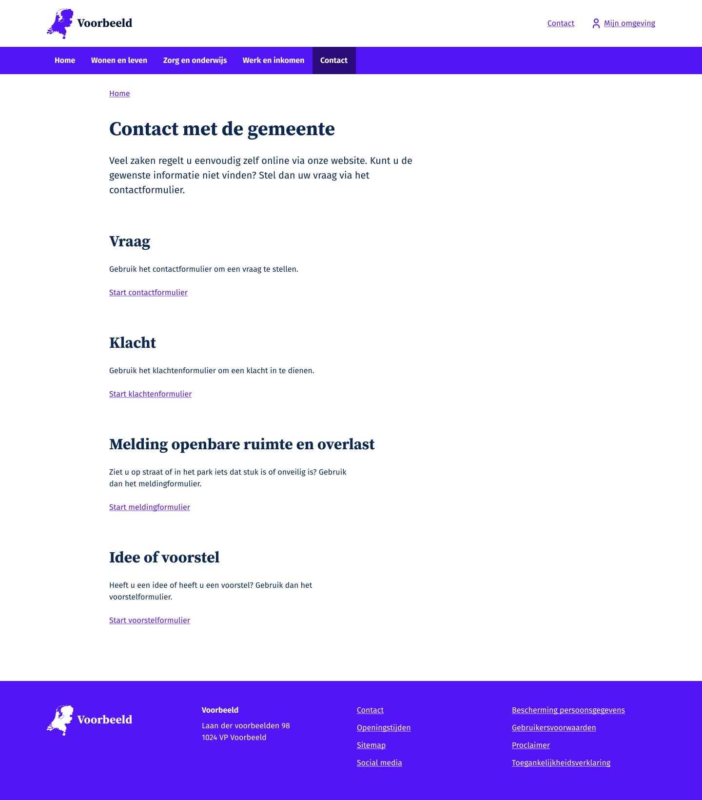\
**Ontwerpadvies 1:** Dit scherm is onderverdeeld in een aantal verschillende onderwerpen: 'Vraag', 'Klacht', 'Melding openbare ruimte en overlast' en een 'Idee of voorstel'. Door te proberen de vraag in een vroeg stadium van de berichtenstroom te categoriseren als formeel of niet-formeel bericht, kunnen deze processen in een vroeg stadium herkend en behandeld worden met in acht name van de Wmebv. Er zijn overigens gemeenten die adviseren het onderscheid niet te maken en alles te behandelen als formeel bericht om zo ten alle tijden te voldoen aan de Wmebv. Gemeente Barneveld licht dit bijvoorbeeld toe in de [Kennissessie Juridische Aspecten van 9 oktober 2023](https://vng.nl/wmebv-webinars-en-kennissessies).

**Scherm B - Uitleg over het formulier:** Een scherm met uitleg over wat de gebruiker te wachten staat, tijdens het invullen van het 'Vraag aan de gemeente' e-formulier.\
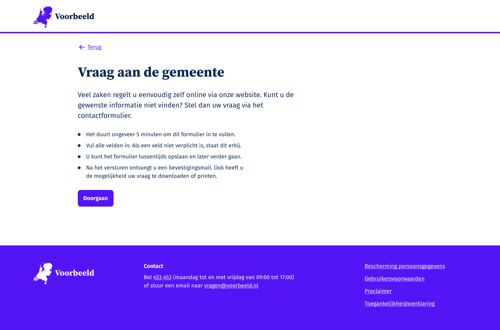\
**Ontwerpadvies en suggesties voor vervolgonderzoek 2:** Op dit scherm worden een aantal punten over wat de gebruiker kan verwachten toegelicht. In dit ontwerp staat dat het 'ongeveer 5 minuten zal duren' echter bleek uit het usability onderzoek dat deze hoeveelheid tijd verschillend werd ervaren. Enkele respondenten vonden 5 minuten te lang klinken. Andere verwachten dat zij hier juist langer over zouden doen. Deze indicatie van '5 minuten' bleek dus niet veel toe te voegen. Wanneer een formulier lang kan duren, ongeacht beperking of niet, zou een tijdsindicatie wellicht wel handig zijn.

**Ontwerpadvies en suggesties voor vervolgonderzoek 3:** Op dit scherm wordt aangegeven 'Vul alle velden in. Als een veld niet verplicht is, staat dit erbij.'. In dit ontwerp is gekozen voor de benadering van het GOV.UK Design System, waarbij [optionele velden gemarkeerd worden](https://design-system.service.gov.uk/patterns/question-pages/) waarbij gesteld wordt dat verplichte velden niet met een \* gemarkeerd moeten worden maar juist optionele velden gemarkeerd worden met 'Optional' wat wij in B1 vertaald hebben naar 'Niet verplicht'. Echter bleek uit de usability studie dat mensen dit niet duidelijk vonden en dat de 'Niet verplicht' gemarkeerde velden sneller overgeslagen werden, terwijl ze wel degelijk van belang kunnen zijn. Denk bijvoorbeeld aan een huistoevoeging. Uit nader onderzoek zou getoetst kunnen worden of misschien het niet B1 woord 'Optioneel' beter zou werken.

**Scherm C - Inloggen:** Keuzescherm om in te loggen\
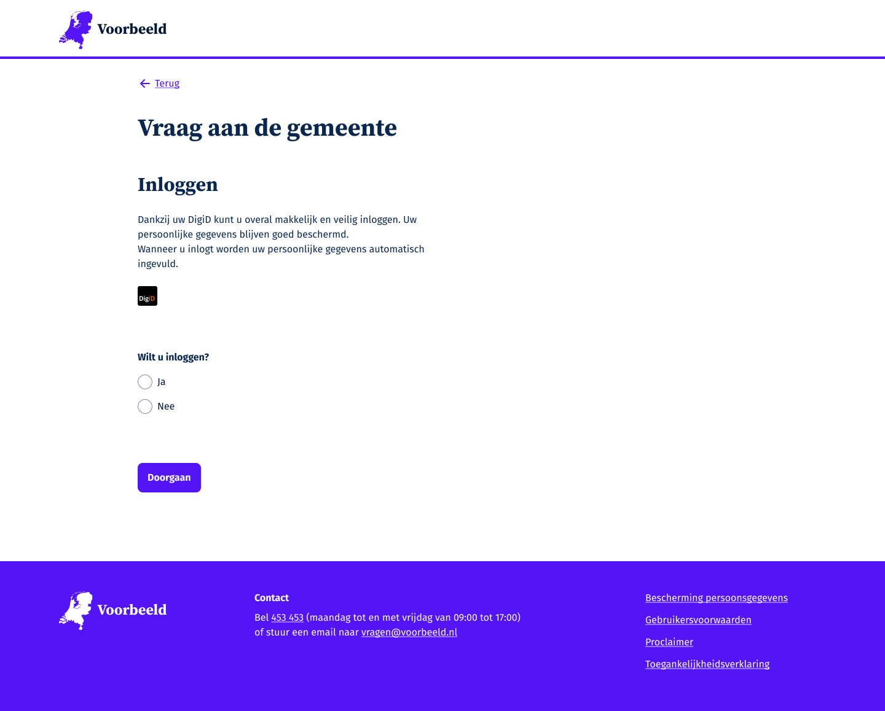\
**Ontwerpadvies en suggesties voor vervolgonderzoek 4** Uit het usability onderzoek bleek dat sommige mensen het formulier hadden verwacht in plaats van een scherm met de mogelijkheid om in te loggen. Uit nader onderzoek moet blijken of dit inlogscherm op een andere plek in de user journey moet zitten of misschien op een andere visuele manier gepresenteerd moet worden. In dit ontwerp was gekozen voor radio buttons met ja en nee, maar misschien zijn mensen meer gebaat bij een andere weergave waarbij de voordelen van inloggen nog duidelijker benoemd staan. De voordelen staan in dit ontwerp maar het merendeel van de participanten las de tekst niet omdat ze veel bezig waren met een keuze te maken om wel of niet in te loggen met 'het moeilijke 'of het 'enge' DigiD.

**Scherm E Formulier stap 1 (E 1/4):** Vraag aan de gemeente invoeren\
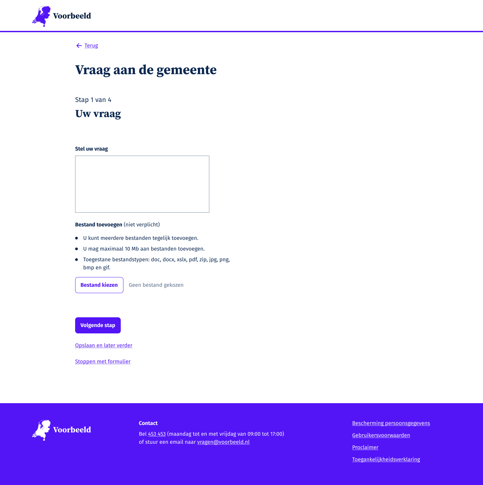\
**Ontwerpadvies en suggesties voor vervolgonderzoek 5:** Uit het usability onderzoek kwam naar voren dat mensen veel hun mobiele apparaten gebruiken waarbij zij baat hebben van de suggestiewoorden die bij een mobieltoetsenbord getoond worden. Dit maakt het, vooral voor de laaggeletterde doelgroep, makkelijker om hun vraag goed te kunnen invoeren. Uit nader onderzoek moet blijken of er een invulhulp bedacht en aangeboden kan worden. Een vertaaloptie zou ook een meerwaarde kunnen bieden voor mensen die de Nederlandse taal niet voldoende beheersen.  Een ander idee zou kunnen zijn om mensen bij het scherm B te informeren dat zij dit formulier ook op een mobiel apparaat kunnen invullen en wat de voordelen daarvan zijn. Een nadeel daarvan zou zijn, dat zij niet bij documenten kunnen die wellicht op hun computer staan.

**Formulier stap 2 (E 2/4):** Contactgegevens invoeren\
\
**Ontwerpadvies en suggesties voor vervolgonderzoek 6:** Indien er is gekozen om in te loggen, dan worden de vooringevulde gegevens die theoretisch vanuit DigiD worden opgehaald, getoond. Dit wordt door de participanten op prijs gesteld. Echter zou in een vervolgonderzoek gekeken kunnen worden wat de gevolgen zijn indien de gegevens niet kloppen. Zou de gebruiker zijn gegevens moeten kunnen aanpassen en wat zijn de gevolgen?\
Indien er niet is ingelogd, vult de gebruiker alle gegevens handmatig in. De velden in het formulier zijn zo gemaakt dat de autocomplete gebruikt kan worden om het invullen eenvoudiger te maken. Uit het usability onderzoek kwam naar voren dat de autocomplete op de juiste manier werkte.

**Formulier stap 3 (E 3/4):** Controleer gegevens en verzend\
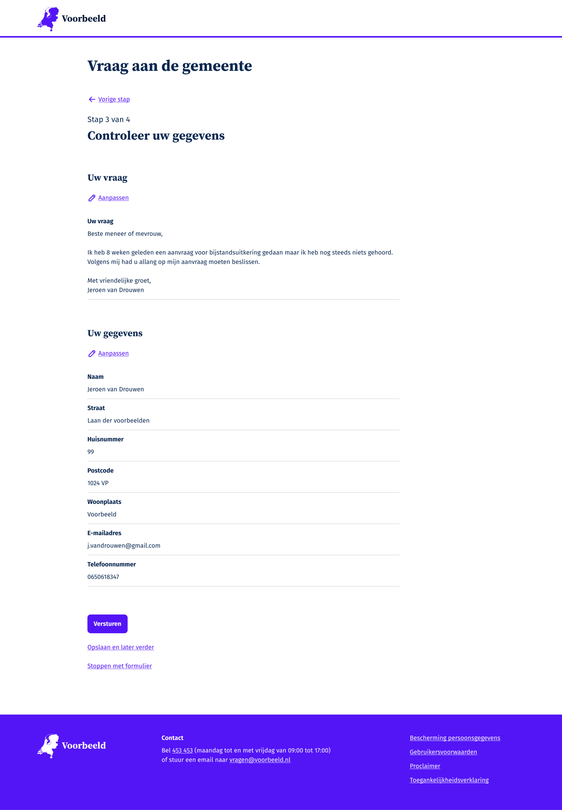\
**Ontwerpadvies en suggesties voor vervolgonderzoek 7:** Uit het usability onderzoek kwam naar voren dat de manier om gegevens aan te passen goed gevonden en gebruikt werd. Echter, de navigatie in dit formulier is dusdanig dat de vervolgstappen doorlopen moeten worden om weer bij "Controleer uw gegevens" uit te komen. Dit leverde in sommige gevallen wat verwarring op. "huh? Waarom moet ik nu ineens weer mijn gegevens invullen? (Gegevens staan vooringevuld.) Dit had ik al gedaan...". Een enkele stap van controle-scherm naar aanpassing en terug naar controle-scherm lijkt beter te zijn. Nader onderzoek zal dit echter moeten uitwijzen\

**Formulier stap 4 (E 3/4):** Uw vraag is met succes verstuurd\
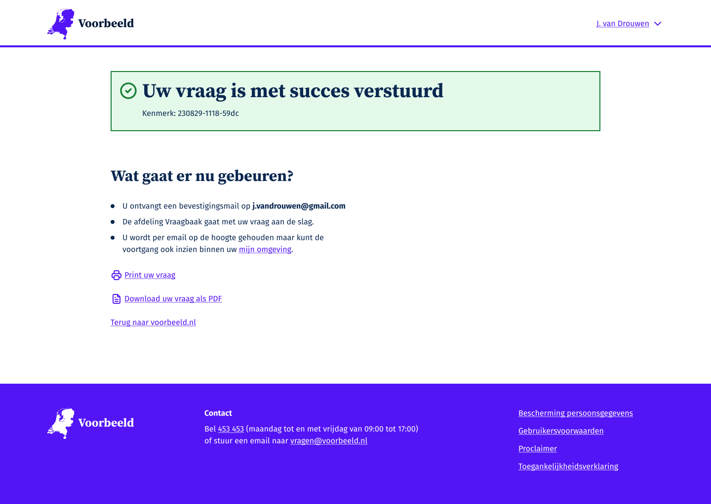\
**Bevinding:** Uit het onderzoek blijkt dat dit scherm duidelijk was voor de participanten. Alle participanten viel het tekstblok 'Wat gaat er nu gebeuren' op en begrepen de vervolgstappen.

Hieronder wordt eerst gekeken naar de Figma schermen van de Gmail omgeving voor het korte scenario (E_kort in de schematische weergave.):

**Gmail inbox (niet ingelogd scenario):** Ontvangstbevestiging in de Inbox\
\
**Bevinding:** Uit het onderzoek bleek dat het onderwerp van de email duidelijk was. Verder geen opvallende bevindingen omdat dit buiten de scope van het onderzoek lag.

**Gmail berichtdetail (niet ingelogd scenario):** Ontvangstbevestiging inhoud emailtje\
\
**Ontwerpadvies en suggesties voor vervolgonderzoek 8:** Uit het onderzoek bleek dat de onderverdeling van de tekst in kopjes duidelijk was. Echter, in het korte scenario, waar een pdf als bijlage bijgevoegd was, leidde het tekstblok over waarom er geen linkjes in de email stonden tot verwarring. Ook verwachtte merendeel van de participanten het antwoord van de gemeente, en niet een ontvangstbevestiging. "Leuk, maar ik wil gewoon antwoord...".

**Gmail PDF (niet ingelogd scenario):** Pdf met ingevulde gegevens\
\
**Bevindingen:** Uit het onderzoek bleek dat de inhoud van de pdf goed leesbaar was met de schermlezer. Deze pdf is in Markdown gemaakt en geëxporteerd naar pdf. Ook hier verwachtten de participanten een antwoord van de gemeente en niet een kopie van de ingevoerde gegevens.

Figma schermen met een nagebootste Gmail omgeving voor scenario E_lang:

**Gmail inbox (wel ingelogd scenario):** Emailtje met "Reactie op uw vraag van de gemeente"\
\
**Bevindingen:** Het onderwerp van de email is duidelijk. Wederom werden de in kopjes verdeelde tekst gewaardeerd en goed begrepen. Het stappenplan was ook duidelijk voor de meeste participanten.

**Gmail berichtdetail (wel ingelogd scenario):** Een email met een een notificatie dat er een reactie van de gemeente in de MijnOmgeving staat.\
\
**Bevinding:** Uit het onderzoek bleek dat mensen het antwoord van de gemeente in de email verwachten. In dit scenario moeten ze echter inloggen in de MijnOmgeving.

**MijnOmgeving overzichtsscherm:** MijnOmgeving Overzicht-scherm waar een zaak klaarstaat.\
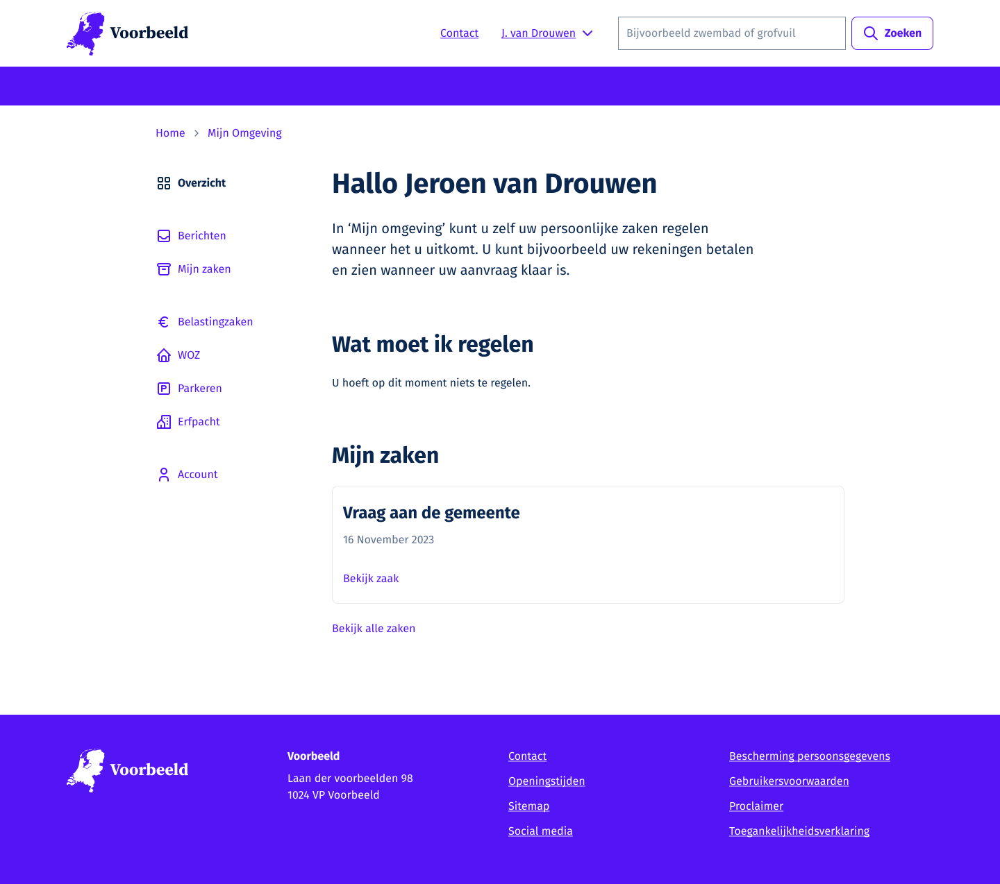\
**Ontwerpadvies en suggesties voor vervolgonderzoek 9:** Merendeel van de participanten gaf aan een indicatie in het linker menu te verwachten, wat aangeeft waar ze de reactie kunnen vinden. Uit vervolgonderzoek moet blijken of een indicatie, zoals bijvoorbeeld een rood bolletje duidelijk werkt. Echter moet nagegaan worden wat de impact is van een dergelijke indicatie, gezien het onderliggende zaaksysteem misschien wel veel meer indicaties kan aangeven. De ontwerpvraag is daarom, welke indicatie verdient een visuele plek en welke niet.

**MijnOmgeving Mijn zaken:** Overzicht van alle zaken, in dit geval maar een.\
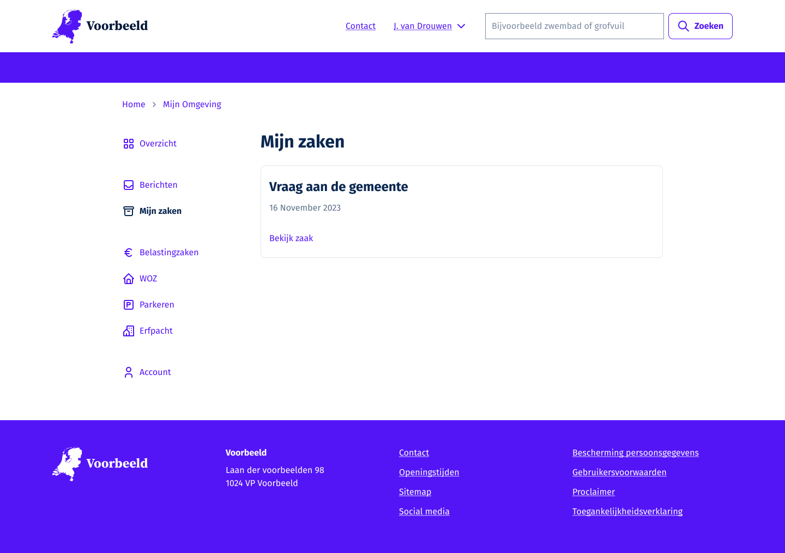\
**Bevinding:** In het geval van dit onderzoek is er maar een zaak beschikbaar. Om grondiger onderzoek te doen naar de MijnOmgeving zal een meer gedetailleerd scenario uitgewerkt moeten worden. In dit onderzoek kwam naar voren dat alle participanten de reactie van de gemeente wisten te vinden.

**MijnOmgeving zaakdetail:** Scherm waarin de reactie van de gemeente te lezen is.\
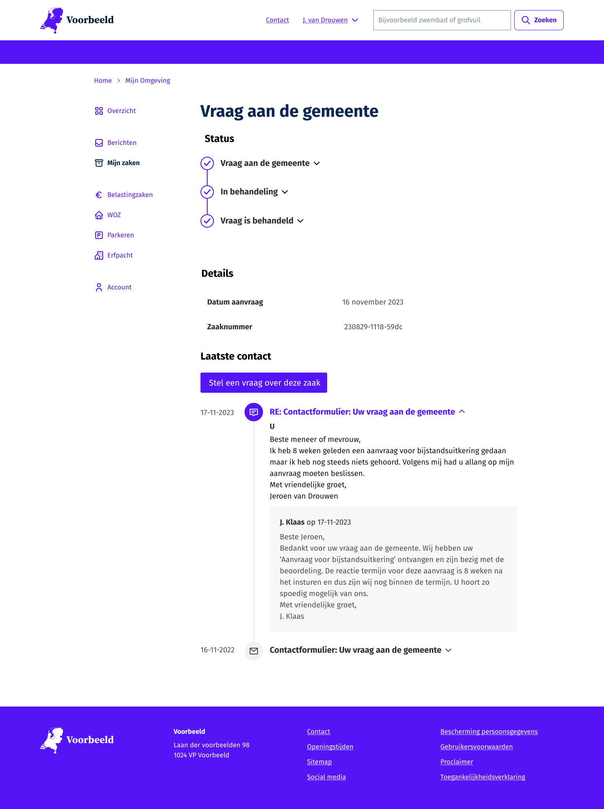\
**Ontwerpadvies en suggesties voor vervolgonderzoek 10:** Uit dit onderzoek bleek dat de volgorde van het zaakdetailscherm verwarrend werkte. Zo staan de statussen van oud naar nieuw gesorteerd en de reacties (onderaan de pagina) van nieuw naar oud. Binnen een van de reacties staat de vraag van Jeroen van Drouwen bovenaan (oud) en de reactie van de gemeente eronder (nieuw). Ook scrolden sommige participanten niet ver genoeg naar beneden om de reactie uiteindelijk snel te kunnen vinden. Het merendeel van de participanten gaf aan dat ze niet veel geven om de statussen maar juist om de reactie. Uit nader onderzoek moet blijken of een andere indeling minder verwarrend werkt.

**Overige bevindingen**\

- Het wisselen tussen platforms (formulier/website gemeente voorbeeld, e-mail, MijnOmgeving) kan verwarrend zijn.
- Men verwacht te kunnen reageren in de MijnOmgeving, alsof het een chat is.
- Waardering voor een overzichtelijke structuur en duidelijk aangegeven invoervelden.
- Positieve reacties op autocomplete benadrukken het belang van tijdbesparende functies.

Bekijk de [uitgewerkte ontwerpen in detail in Figma.](https://www.figma.com/proto/iIr1gkAR3oZ0UFWKIni8Nv/VNG---WMEBV---Templates?page-id=1783%3A7195&type=design&node-id=1783-13018&viewport=2044%2C220%2C0.06&t=ZgGyDyuCmc73YbAh-1&scaling=min-zoom&starting-point-node-id=1783%3A13018&mode=design) en bekijk de [live demo van de geprogrammeerde schermen](https://www.gemeentevoorbeeld.nl/wmebv)

# 7. Bronnen en overige informatie

## 7.1. Stappenplan implementatie Wmebv

Voor meer informatie over een mogelijke aanpak voor de implementatie van de Wmebv wordt verwezen naar dit [Stappenplan wet Wmebv](https://vng.nl/artikelen/stappenplan-wet-mebv) ter ondersteuning bij de implementatie van de Wmebv binnen uw organisatie, waarin de volgende onderwerpen behandeld worden:

**Digitalisering van de dienstverlening:**

1. Wat vraagt de Wmebv?
2. Hoe kan ik het aanpakken?
3. Slim digitaliseren met de [omnichannelaanpak](https://vng.nl/omnichannel).
4. Analyse huidige digitale kanalen met behulp van de [Uniforme Productnamen Lijst](https://vng.nl/projecten/uniforme-productnamen-lijst-upl).
5. Besluit en communiceer de gekozen kanalen.
6. Bepaal uw beleid t.a.v. een ([Omnichannel](https://vng.nl/omnichannel)) kanaalstrategie.
7. Aan de gang met implementeren.

Kijk voor meer informatie over de Omnichannel strategie naar de video-opname van 10 oktober 2023, [Kennissessie 2: Omnichannel](https://vng.nl/wmebv-webinars-en-kennissessies).

**Zorgplicht bij de dienstverlening:**

1. Bepaal welke belemmeringen inwoners ervaren.
2. Bepaal hoe u belemmeringen kunt wegnemen.
3. Leg uw keuzes voor zorgplicht vast in een beleidsdocument.
4. Communiceer hoe uw gemeente ondersteunt bij de dienstverlening.

## 7.2. Bronnen

(Gesorteerd op chronologische volgorde in het document.)

- [Handreiking implementatie Wet modernisering elektronisch bestuurlijk verkeer (Awb) 2023.](https://www.digitaleoverheid.nl/wp-content/uploads/sites/8/2017/04/Handreiking-implementatie-Wet-modernisering-elektronisch-bestuurlijk-verkeer-2023.pdf)
  
- [Video - Kennissessie 1:  Juridisch Aspecten](https://youtu.be/7Vujk18JA-g)
- [Video - Kennissessie 6: Digitale interactie over onder andere Generieke services](https://www.youtube.com/watch?v=m2x146aH9YM)
- [Video's - VNG webinars en kennissessies](https://vng.nl/wmebv-webinars-en-kennissessies)
- [Notificatie en Wmebv door Logius.](https://www.logius.nl/domeinen/interactie/mijnoverheid/wet-modernisering-elektronisch-bestuurlijk-verkeer)
- [Video - Kennissessie 3: Zorgplicht](https://vng.nl/wmebv-webinars-en-kennissessies)
- [Digitale toegankelijkheid](https://digitaaltoegankelijk.nl/)
- [Web Content Accessibility Guidelines (WCAG)](https://www.w3.org/WAI/standards-guidelines/wcag/)
- [Tekst op B1 niveau](https://ishetb1.nl/)
- [Testen op kleurcontrast](https://www.toptal.com/designers/colorfilter)
- [Toegankelijke documenten met OpenDocument](https://opendocumentformat.org/guidance/accessibility/)
- [Pdf's zo digitaal toegankelijk mogelijk](https://accessible-pdf.info/en/basics/)
- [Richtlijnen voor taalgebruik](https://www.communicatierijk.nl/vakkennis/rijkswebsites/aanbevolen-richtlijnen/taalniveau-b1)
- [Pagina voor richtlijnen voor formulieren van NL Design System](https://nldesignsystem.nl/richtlijnen/formulieren/overzicht)
- [Wettelijke vereisten voor rechtsgeldigheid](https://www.rijksoverheid.nl/onderwerpen/digitale-overheid/digitale-veiligheid-en-identiteit)
- [Alles over privacybescherming](https://www.rijksoverheid.nl/onderwerpen/privacy-en-persoonsgegevens)
- [Alles over beveiligingsmaatregelen](https://www.cip-overheid.nl/)
- [Het juiste mobile toetsenbord](https://www.mobilespoon.net/2018/12/10-usability-rules-keyboard-mobile-app.html)
- [Responsive versus Adaptive ontwerp.](https://www.uxpin.com/studio/blog/responsive-vs-adaptive-design-whats-best-choice-designers/)
- [Artikel over Help en Documentation.](https://www.nngroup.com/articles/help-and-documentation/)
- [Al met vijf participanten veel usability inzicht](https://www.nngroup.com/articles/how-many-test-users/)
- [Toolkit Meten en Verbeteren van webformulieren.](https://vng.nl/kennisbank-dienstverlening-gemeenten/toolkit-meten-en-verbeteren-van-webformulieren)
- [The A11Y project - over toegankelijke formulieren](https://www.a11yproject.com/posts/how-to-write-accessible-forms/)
- [World Wide Web Consortium (W3C) over WCAG](https://www.w3.org/WAI/standards-guidelines/wcag/)
- [NL Design System](https://nldesignsystem.nl/)
- [Video presentatie over design tokens](https://youtu.be/n9m2TtD1esE?si=oVwolw51XTtgmt28)
- [Design Systems Week](https://nldesignsystem.nl/events/design-systems-week-2023/en/overview/)
- [Tekstuele toelichting op design tokens](https://nldesignsystem.nl/meedoen/design-tokens/)
- [NL Design System Storybook](https://nl-design-system.github.io/themes/?path=/story/blockquote--gemeente-utrecht)
- [Estafettemodel](https://nldesignsystem.nl/meedoen/estafettemodel)
- [Slack (een berichten applicatie voor communities)](https://slack.com/)
- [Design Open Hour](https://nldesignsystem.nl/meedoen/als-designer/community/)
- [Heartbeat sessies](https://nldesignsystem.nl/project/blijf-op-de-hoogte)
- [Design System van het United Kingdom](https://design-system.service.gov.uk/)
- [Onderzoek naar gebruikersvriendelijkheid van generieke services](https://vng.nl/artikelen/ux-onderzoek-generieke-services)
- [Heartbeat sessie van 31 oktober 2023](https://nldesignsystem.nl/events/heartbeat/#heartbeat)
- [Implementatiepilot Wet modernisering elektronisch bestuurlijk verkeer (Wmebv)](https://vng.nl/brieven/verslag-pilots-wetsvoorstel-wet-modernisering-elektronisch-bestuurlijk-verkeer-wmebv)
- [VNG Wmebv Figma omgeving](https://www.figma.com/file/iIr1gkAR3oZ0UFWKIni8Nv/VNG---WMEBV---Templates?type=design&node-id=315%3A89&mode=design&t=OlU3fZjF6snJQaPk-1)
- [Voor designers met NL Design System](https://nldesignsystem.nl/meedoen/als-designer/overzicht)
- [Richtlijnen voor het goed programmeren van formulieren](https://nldesignsystem.nl/richtlijnen/formulieren/overzicht)
- [De Github voor gemeente Voorbeeld](https://github.com/frameless/gemeentevoorbeeld.nl)
- [Voor developers met NL Design System](https://nldesignsystem.nl/meedoen/als-developer/overzicht)
- [Omnichannel aanpak](https://vng.nl/omnichannel)
- [Video - Kennissessie 2: Omnichannel](https://vng.nl/wmebv-webinars-en-kennissessies)
- [Open Source](https://opensource.org/definition-annotated/)
- [Figma](https://www.figma.com/design/)
- [Gebruikersonderzoeken.nl](https://gebruikersonderzoeken.nl/)
- [Uitgewerkte ontwerpen van het generieke formulier in Figma.](https://www.figma.com/proto/iIr1gkAR3oZ0UFWKIni8Nv/VNG---WMEBV---Templates?page-id=1783%3A7195&type=design&node-id=1783-13018&viewport=2044%2C220%2C0.06&t=ZgGyDyuCmc73YbAh-1&scaling=min-zoom&starting-point-node-id=1783%3A13018&mode=design)
- [Live demo van het geprogrammeerde generieke formulier](https://www.gemeentevoorbeeld.nl/wmebv)
- [Over duidelijke overheidscommunicatie](https://vng.nl/projecten/duidelijke-overheidscommunicatie)
- [Stappenplan wet Wmebv](https://vng.nl/artikelen/stappenplan-wet-mebv)

## 7.3. Overige interessante links

- [Vng Wmebv](https://vng.nl/wmebv)
- [VNG Forum - Praat mee!](https://vng.nl/artikelen/vng-forum)
