# Handreiking Wmebv e-formulieren en notificaties

- [Handreiking Wmebv e-formulieren en notificaties](#handreiking-wmebv-e-formulieren-en-notificaties)
  - [Introductie](#introductie)
    - [Totstandkoming handreiking](#totstandkoming-handreiking)
    - [Doel van deze handreiking](#doel-van-deze-handreiking)
    - [Doelgroep](#doelgroep)
    - [Samenwerkingspartners](#samenwerkingspartners)
  - [Wet Modernisering Bestuurlijk Verkeer](#wet-modernisering-bestuurlijk-verkeer)
    - [Wmebv samengevat in vier punten](#wmebv-samengevat-in-vier-punten)
    - [Wat zijn 'Formele berichten'?](#wat-zijn-formele-berichten)
    - [Wmebv schematisch weergegeven](#wmebv-schematisch-weergegeven)
  - [Theorie: E-formulieren en notificaties](#theorie-e-formulieren-en-notificaties)
    - [Ontwerpcriteria voor E-formulieren en Notificaties](#ontwerpcriteria-voor-e-formulieren-en-notificaties)
    - [Praktische adviezen voor het ontwerpen en toetsen van e-formulieren en notificaties](#praktische-adviezen-voor-het-ontwerpen-en-toetsen-van-e-formulieren-en-notificaties)
  - [Praktijk: Generiek e-formulier op basis van NL Design System](#praktijk-generiek-e-formulier-op-basis-van-nl-design-system)
    - [Project achtergrond en doelstelling](#project-achtergrond-en-doelstelling)
    - [NL Design System](#nl-design-system)
      - [Wat is NL Design System](#wat-is-nl-design-system)
      - [Hoe NL Design System te gebruiken](#hoe-nl-design-system-te-gebruiken)
    - [Ontwerp Generieke e-formulier in Figma met NL Design System](#ontwerp-generieke-e-formulier-in-figma-met-nl-design-system)
      - [Het scenario: Gemeente in gebreken stellen](#het-scenario-gemeente-in-gebreken-stellen)
      - [Development en Code Snippets (Verwijzing)](#development-en-code-snippets-verwijzing)
      - [Usability Tests en Resultaten](#usability-tests-en-resultaten)
  - [Geleerde Lessen en Aanbevelingen](#geleerde-lessen-en-aanbevelingen)
  - [Aanvullende Bronnen en Links voor Verdieping](#aanvullende-bronnen-en-links-voor-verdieping)
    - [Links](#links)
    - [Stappenplan implementatie Wmebv](#stappenplan-implementatie-wmebv)
    - [Overige interessante bronnen](#overige-interessante-bronnen)
  - [Appendix A: Het scenario in schermen](#appendix-a-het-scenario-in-schermen)
  

## Introductie

### Totstandkoming handreiking

Deze handreiking is tot stand gekomen in opdracht van de Vereniging van Nederlandse Gemeenten Realisatie (VNGR) in samenwerking met NL Design System. Voor de handreiking zijn verschillende bronnen gebruikt. Naast desk-research is er een generiek e-formulier op basis van het NL Design System ontworpen en ontwikkeld. Het generieke e-formulier en de bijbehorende scenario's zijn ontwikkeld om inzage te geven in hoe enerzijds omgegaan zou kunnen worden met producten die nog niet beschikken over een e-formulier en anderzijds om te laten zien hoe met het gebruik van NL Design System binnen een relatief korte tijd gekomen kan worden tot een gebruikersvriendelijk en toegankelijk e-formulier. Het e-formulier en de bijbehorende vervolgschermen, en daarmee dus het scenario, zijn voorgelegd aan experts binnen de VNG, de NL Design System Community en tevens getoetst door Stichting Accessibility zodat deze handreiking in de praktijk gevalideerd is.

### Doel van deze handreiking

De doel van deze handreiking is om inzichten te delen betreft het ontwerpen en ontwikkelen van een generiek e-formulier op basis van NL Design System zodat deze voldoet aan de wet modernisering bestuurlijk verkeer (Wmebv). Tevens wordt gekeken naar wat de Wmebv betekent voor notificaties. De volgende onderwerpen worden in deze handreiking behandeld:

- Wmebv in het kort
- Ontwerpcriteria voor het maken van Wmebv proof e-formulieren en notificaties
- Het ontwerpen en ontwikkelen van een generiek formulier met behulp van NL Design System voor een brede generieke inzet.
- Implementatieadviezen met betrekking tot het Wmebv proof maken van e-formulieren en notificaties.

### Doelgroep

Deze handreiking is bestemd voor ieder die meer te weten wil komen over het Wmebv proof maken van e-formulieren en notificaties.

### Samenwerkingspartners

Deze handreiking en de bijbehorende schermvoorbeelden zijn een samenwerking van VNGR met het NL Design System kernteam, (UX) designers uit de NL Design System Community en met name de UX designer van Gemeente Den Haag, waar al veel onderzoek gedaan is naar de gebruikersvriendelijkheid van notificaties.

## Wet Modernisering Bestuurlijk Verkeer

In de Handreiking van Het Ministerie van Binnenlandse Zaken in samenwerking met Logius wordt het doel van deze wet helder benoemd:

> De regering wil in het kader van de digitaal werkende overheid komen tot de implementatie van het wetsvoorstel modernisering elektronisch bestuurlijk verkeer. Met name de huidige regel dat een bestuursorgaan verkeer via de elektronische weg moet toestaan en dus ook kan uitsluiten, wordt als verouderd ervaren. Kabinetsbeleid is daarom dat bedrijven en burgers zaken die ze met de overheid doen – zoals het aanvragen van een vergunning – digitaal moeten kunnen afhandelen. Elektronisch bestuurlijk verkeer kan bijdragen aan de vermindering van administratieve lasten van burgers en bestuurlijke lasten van bestuursorganen. De wet neemt belemmeringen weg en stelt enkele randvoorwaarden aan de modernisering en digitalisering van de werkprocessen binnen de publieke sector. Burgers en bedrijven krijgen het recht (niet de plicht) om ieder formeel bericht elektronisch aan de overheid te zenden. Bij gebruik van de elektronische weg gelden er nieuwe waarborgen, waardoor nog meer rechtsbescherming wordt gerealiseerd. Tegelijkertijd houden bestuursorganen ruimte om digitale processen af te stemmen op de eigen organisatie. Om een compacte, efficiënte overheid te realiseren met hoogwaardige dienstverlening, is digitalisering een vereiste en is het digitale kanaal het voorkeurskanaal. Het uitgangspunt is: digitaal waar het kan. Het doel van de Wmebv is om regels over elektronisch bestuurlijk verkeer te moderniseren en burgers en bedrijven het recht te geven om elektronisch zaken te doen met de overheid. Degenen die dat willen moeten voor het digitale kanaal kunnen kiezen in hun contact met de overheid. Om te waarborgen dat iedereen met de overheid kan (blijven) communiceren, is het van belang dat communicatie langs de papieren weg mogelijk blijft. En dat de provincie een inclusief beleid voor ondersteuning van bepaalde doelgroepen gaat uitvoeren.

Bron: [Handreiking implementatie Wet modernisering elektronisch bestuurlijk verkeer (Awb) 2023.](https://www.digitaleoverheid.nl/wp-content/uploads/sites/8/2017/04/Handreiking-implementatie-Wet-modernisering-elektronisch-bestuurlijk-verkeer-2023.pdf)

### Wmebv samengevat in vier punten

De Wmebv is een belangrijk element in de bredere digitale transformatie van overheidsdiensten in Nederland en het is ontworpen om de overgang naar een meer digitaal georiënteerd bestuurlijk verkeer te vergemakkelijken.

- Wmebv is een wijziging van de Algemene Wet Bestuursrecht
- Wmebv geeft het recht op digitaal communiceren met bestuursorganen
- Wmebv stelt het openstellen van digitale kanalen verplicht, voor ieder formeel bestuurlijk bericht gericht aan het bestuursorgaan
- Wmebv resulteert in het aanpassen van digitale kanalen zodat het aan de wettelijk gestelde eisen voldoet.

### Wat zijn 'Formele berichten'?

Voordat er iets dieper ingegaan wordt over de Wmebv, is het belangrijk om aan te geven om wat voor berichtenverkeer het gaat in de Wmebv. In de diverse documentatie betreft de Wmebv wordt er op verschillende manieren gerefereerd naar het 'Elektronisch Bestuurlijk Verkeer''. Dit verkeer, in de vorm van digitale berichten, wordt in diverse documentatie ook wel 'Officiële berichten', 'Formele berichten' en 'Formeel officiële berichten' genoemd. In alle gevallen wordt hetzelfde bedoeld. In deze handreiking wordt de term 'formele berichten' aangehouden. Met het Elektronische Bestuurlijk Verkeer worden dus de 'formele berichten' bedoeld en deze verwijzen doorgaans naar officiële communicatie tussen verschillende bestuurlijke niveaus binnen een overheid. Deze berichten bevatten vaak belangrijke mededelingen, beslissingen, of andere informatie van juridische of bestuurlijke aard. Enkele veelvoorkomende voorbeelden:

- Berichten die deel uit maken van een procedure of besluit (zoals bijvoorbeeld: een aanvraag, zienswijze, ingebrekestelling of bezwaarschrift)
- een klacht
- anders krachtens wettelijk voorschrift voorgeschreven bericht. Bijvoorbeeld een melding.

Niet-officieel bestuurlijke berichten zijn alle andere berichten zoals informele contacten.

Het exacte bereik en de aard van formele berichten kunnen sterk variëren, dus het is belangrijk om de specifieke wetgeving en bestuurlijke structuren in overweging te nemen om een vollediger beeld te krijgen van welke producten onder deze term vallen. Voor deze handreiking is het echter van belang het verschil tussen niet formele berichten en formele berichten aan te duiden, om zo duidelijk te maken dat de Wmebv niet voor alle processen/producten geldt maar enkel voor de formele berichten. Voor meer verdieping in de juridische aspecten wordt verwezen naar de video-opname van [Kennissessie 1:  Juridisch Aspecten](https://youtu.be/7Vujk18JA-g) van 9 oktober 2023, die te vinden is op de website: [VNG webinars en kennissessies](https://vng.nl/wmebv-webinars-en-kennissessies)

### Wmebv schematisch weergegeven

Om toch in deze handreiking een idee te geven van de strekking van de Wmebv, wat veel verder strekt dan enkel e-formulieren en notificaties, worden de belangrijkste aspecten op een rij gezet.
Zie echter voor een zeer uitgebreide toelichting op de Wmebv de [Handreiking implementatie Wet modernisering elektronisch bestuurlijk verkeer (Awb) 2023.](https://www.digitaleoverheid.nl/wp-content/uploads/sites/8/2017/04/Handreiking-implementatie-Wet-modernisering-elektronisch-bestuurlijk-verkeer-2023.pdf) van het Ministerie van Binnenlandse Zaken.

Allereerst is het belangrijk om te weten dat de Wmebv over processen of beter gezegd, communicatiestromen gaat. Communicatiestromen tussen burger en overheidsinstantie. De stroom van een formeel bericht kent een begin en een eind. De stroom verloopt in verschillende fasen. Een formeel bericht wordt geïnitieerd (Zie het schema: 'Voor ontvangst') en vervolgens verstuurd. Als het goed gaat, wordt het bericht ontvangen door de overheidsinstantie (Zie het schema: 'Na ontvangst'). Vervolgens wordt het bericht in behandeling genomen en tijdens de behandeling kunnen vervolgacties voor de burger of instantie voortvloeien. Deze acties worden uitgevoerd, gelogd en er wordt over gecommuniceerd (zie het schema: 'Uitgaande formele berichten'), net zolang tot de behandeling van de initiële vraag of de daaruit voortgevloeide vragen of acties afgehandeld zijn. Naast de ze digitale communicatiestroom van formele berichten tussen burger en instantie, regelt de Wmebv een zorgplicht die stelt dat er voor passende ondersteuning gezorgd moet worden voor de mensen die minder goed mee kunnen komen in de digitale wereld.\
\
De aspecten van de Wmebv zijn op te delen in onder andere een aantal blokken met daarin fasen waarin een formeel bericht zich bevindt:

**Blok 1 - Binnenkomende formele berichten:**\
Dit blok is onder te verdelen in twee fasen:

**Fase 1 - Voor ontvangst:**\
Een formeel bericht kan op verschillende manieren binnenkomen, afhankelijk van het gekozen/aangeboden digitale kanaal. Denk aan:

- Een generiek contactformulier met upload mogelijkheid. (Later in deze handreiking wordt een voorbeeld behandeld van een generiek formulier.)
- E-mailkanaal (Echter, de meningen zijn nog verdeeld over hoe veilig dit medium is.)
- Specifiek webformulier met DigiD / e-Herkenning
- Via een MijnOmgeving
- Via een Berichtenbox (Bijvoorbeeld MijnOverheid)

De Wmebv regelt dat instanties de wijze van indienen bekend maken door kanalen aan te wijzen en dit bijvoorbeeld vast te leggen in een aanwijzingsbesluit en de burgers te informeren over het aangewezen digitale kanaal.
Er zijn een aantal belangrijke punten voordat een officieel bericht ontvangen kan worden:

- De digitale weg veilig moet veilig zijn. Belastende of onveilige berichten worden geweigerd.
- Er mogen geen technische eisen gesteld worden die onnodig belemmerend zijn.
- Er mogen geen gegevens afgedwongen worden zonder grondslag. Alleen noodzakelijke gegevens mogen worden uitgevraagd.
- De gemeente heeft de bevoegdheid tot het verlengen van de indieningstermijn bij storing en dient dit bekend te maken op bijvoorbeeld de website.

**Fase 2 - Na ontvangst:**\
De Wmebv regelt dat er ontvangstbevestiging verstuurd moet worden. Indien berichten intern doorgeleid zijn of afgewezen zijn, dient dit medegedeeld te worden.

Intern doorgeleiden is verplicht als:

- het bericht zonder nadere bewerking behandeld kan worden
- het bezwaarschrift of beroepsschrift is
- voor het type bericht geen wijze van verzending is aangewezen.
- de aanvang wettelijke behandeltermijn opschuift naar tijdstip van het intern doorleiden
- mededelingen aan de afzender van het doorgeleiden en tijdstip waarop de termijn aanvangt

De Wmebv regelt ook dat indien een bericht verkeerd is ingezonden, en om die reden is afgewezen, dat er een mededeling aan de afzender gezonden moet worden waarin vermeld wordt wat de juiste wijze van indiening is.

De Wmebv regelt dat ingevulde gegevens van een e-formulier terug-getoond moeten worden. Hetzij via:

- een download mogelijkheid tijdens het aanvraagproces
- inzage via een MijnOmgeving
- het toezenden van het afschrift

_**Wmebv-ontwerptip:**\
Denk bij het ontwerpen van deze communicatie aan de hierboven genoemde punten._

 Tot slot dient de gemeente bewijslast te hebben, dat betekent dat een systeem moet zijn waarin gegevens gelogd worden.

**Blok 2 - Uitgaande formele berichten:**\
Dit blok is niet verder onderverdeeld in fasen. Bij dit blok geld dat de Wmebv regelt dat als er genotificeerd wordt, dat er met een aantal zaken rekening gehouden moeten worden, namelijk:

- de afzender moet worden vermeld
- de aard van het bericht moet worden vermeld (Bijv. ontvangstbevestiging, beschikking, betalingsverplichting etc.)
- en een reactietermijn
- Indien een bericht of notificatie niet bezorgd kan worden (een bounce) dan moet het minimaal eenmaal opnieuw verzonden worden.
- De gemeente heeft een inspanningsverplichting om het juiste e-mailadres te achterhalen
- Notificaties moeten op andere wijze verzonden kunnen worden

In het volgende hoofdstuk wordt nog iets dieper ingegaan op notificaties.\
_**Wmebv-ontwerptip:**\
Denk bij het ontwerpen van deze communicatie aan de hierboven genoemde punten._ <mark>Notificatie templates</mark>

De gemeente heeft tevens een bewijslast en moet het volgende kunnen bewijzen:

- Het tijdstip van verzending of ontvangst
- De verzending met de samenhangende ontvangstbevestiging of notificatie
- Tijdstip inlog geadresseerde om kennis te nemen van een aan hem gezonden bericht
- Ontvangen meldingen van formele berichten die niet konden worden bezorgd

Voor meer verdieping in de juridische aspecten wordt verwezen naar de video-opname van [Kennissessie 1:  Juridisch Aspecten](https://youtu.be/7Vujk18JA-g) van 9 oktober 2023, die te vinden is op de website: [VNG webinars en kennissessies](https://vng.nl/wmebv-webinars-en-kennissessies)

**Blok 3 - Zorgplicht:**\
Tot slot staat  in het schema de zorgplicht genoemd.
De Wmebv regelt tevens een zorgplicht voor passende ondersteuning bij communicatie.
Denk hierbij aan:

- Passende ondersteuning is afgestemd op de doelgroepen en hun vaardigheden (lezen, schrijven, omgaan met digitale apparaten)
- Passende ondersteuning is generiek (zoals informatie op een website) en persoonlijk (zoals hulp aan de telefoon of balie)
- Bij Passende ondersteuning is maatwerk niet verplicht
- Beleid over passende ondersteuning opstellen en publiceren op de website (bijvoorbeeld regels of een (uiteraard toegankelijke) handreiking)

Voor een uitgebreide toelichting op de Zorgplicht wordt verwezen naar de video-opname van 11 oktober 2023, [Kennissessie 3: Zorgplicht](https://vng.nl/wmebv-webinars-en-kennissessies)

## Theorie: E-formulieren en notificaties

### Ontwerpcriteria voor E-formulieren en Notificaties

Hieronder een praktische lijst met ontwerpcriteria waarmee rekening gehouden dient te worden tijdens het ontwerp van e-formulieren en notificaties.

**Algemene ontwerpcriteria:**

(Let op, de \*\* gemarkeerde punten zijn ook van toepassing op de Wmebv.)

1. Vul invulvelden waar mogelijk voor in
2. Geef voorwaarden, uitleg, benodigde informatie, documenten aan
3. Gebruik duidelijke taal en begrippen
4. Licht vragen en termen toe, waar nodig
5. Vraag alleen noodzakelijke gegevens en informatie \*\*
6. Geef aan welke vragen/velden verplicht zijn
7. Geef foutmeldingen duidelijk en gebruikersvriendelijk aan
8. Geef processtap in formulier aan tijdens het invulproces
9. Ondersteun de bezoeker bij het invullen en afronden, door duidelijke knoppen
10. Zorg voor tussentijdse opslag van informatie

AVG-regeltjes waar rekening mee moet worden gehouden:

- Wees transparant
- Verzamel zo min mogelijk persoonsgegevens \*\*
- Vraag toestemming
- Gebruik eenvoudige taal
- Verzend e-formulieren over versleutelde verbindingen. \*\*
- Registreer verwerking in verwerkingsregister \*\*

**Wmebv ontwerpcriteria:**\
Op zich zijn onderstaande punten niet perse e-formulier ontwerpcriteria, echter moet er wel rekening mee gehouden worden tijdens het ontwerp van de communicatiestroom waar het e-formulier of notificatie onderdeel vanuit maakt.

- Toon of verstuur (indien mogelijk) een ontvangstbevestiging
- Maak ingevulde gegevens toegankelijk voor de indiener.

Deze lijst is onder andere geput uit de door de VNG aangeboden [Toolkit Meten en Verbeteren van Webformulieren.](https://vng.nl/kennisbank-dienstverlening-gemeenten/toolkit-meten-en-verbeteren-van-webformulieren)

Voor meer gedetailleerde informatie over notificaties wordt verwezen naar [de bijdrage over notificatie en Wmebv door Logius.](https://www.logius.nl/domeinen/interactie/mijnoverheid/wet-modernisering-elektronisch-bestuurlijk-verkeer) Waar onder andere toelichting gegeven wordt op de nieuwe notificatie templates die door hen ontwikkeld zijn en nieuwe technische mogelijkheden zoals een nieuwe variabele voor een 'einddatum handelingstermijn'.

### Praktische adviezen voor het ontwerpen en toetsen van e-formulieren en notificaties

Bij het toetsen van formulieren en notificaties Wmebv is het van belang om te zorgen dat deze voldoen aan de eisen van de wet, met een focus op digitale toegankelijkheid en gebruiksvriendelijkheid. Hier zijn enkele specifieke punten waaraan aandacht besteed zou moeten worden:

**Digitale Toegankelijkheid:**\
Zorg ervoor dat formulieren en notificaties voldoen aan de richtlijnen voor [digitale toegankelijkheid](https://digitaaltoegankelijk.nl/over-digitale-toegankelijkheid/?gad_source=1&gclid=CjwKCAiAu9yqBhBmEiwAHTx5pwysW_wLxGEtgB5WBIudRJTs5oxdsWq63pcDaPVHx0wiFQwHvbKfQRoCnssQAvD_BwE), zoals vastgesteld in de [Web Content Accessibility Guidelines (WCAG)](https://www.w3.org/WAI/standards-guidelines/wcag/). De meest voor de hand liggende punten om rekening mee te houden:

- De structuur van het formulier zowel in de frontend als de backend moet goed in elkaar zitten, vermijd hierbij, indien mogelijk, horizontale layout. Voorzie alle inputvelden van een label.
  
  **_Tip voor een onderzoeksvraag:_**\
  _Wordt het formulier met een screen reader in de juiste volgorde voorgelezen?_\
  
- Maak foutmeldingen visueel en tekstueel duidelijk. Leid de gebruiker naar de plek waar de fout opgelost moet worden.

  **_Tip voor een onderzoeksvraag:_**\
  _Kunnen gebruikers met diverse niveaus van geletterdheid en visueel, auditieve en fysieke beperkingen, zonder in de stress te raken, de fouten in het formulier vinden en oplossen?_\
  
- Zorg ervoor dat formulieren met het toetsenbord bediend kunnen worden.
- Houdt rekening met tijdslimieten waarin een formulier ingevuld moet worden, niet iedereen kan dit in een vergelijkbaar tempo.
  
  **_Tip voor een onderzoeksvraag:_**\
   _Kunnen gebruikers met diverse niveaus van geletterdheid en visueel, auditieve en fysieke beperkingen, zonder muis en met een toetsenbord eenvoudig door het formulier navigeren binnen een eventueel gestelde tijd?_
- Vertrouw niet alleen op kleur. zorg voor leesbare [tekst op B1 niveau](https://ishetb1.nl/) en [test het kleurcontrast](https://www.toptal.com/designers/colorfilter) in verband met de vele vormen en gradaties van kleurenblindheid.\
\
Bron: [https://www.toptal.com](https://www.toptal.com)

- Zorg ervoor dat de formulieren ook goed werken op mobiele apparaten zoals telefoons en tablets. Houdt hierbij extra rekening met dat het [juiste mobile toetsenbord](https://www.mobilespoon.net/2018/12/10-usability-rules-keyboard-mobile-app.html) wordt aangeboden bij de bijbehorende velden. Qwerty bij tekstvelden, nummerriek bij nummervelden etc. Uit het recent uitgevoerde usability onderzoek dat verderop in dit document wordt toegelicht, kwam naar voren dat het merendeel van de participanten gebruikmaken van hun mobile telefoon of tablet om dergelijke formulieren in te vullen. Daarbij zijn ze vaak geholpen met de woordsuggesties die het mobile apparaat toont, om zo sneller een tekst te kunnen produceren.<mark>afbeelding toetsenbord</mark>

Naast toegankelijk formulieren is het ook belangrijk de eventuele bijlagen in de vorm van documenten digitaal toegankelijk te maken. Zoals digitaal toegankelijke pdf's of afbeeldingen die voor mensen die blind of slechtziend is niet te ontcijferen zijn.

- Overweeg om in plaats van pdf's, toegankelijke HTML te gebruiken indien de inhoud enkel bekeken dient te worden
- Overweeg om [OpenDocument](https://opendocumentformat.org/guidance/accessibility/) te gebruiken voor pdf-formulieren die aanpasbaar moeten zijn.
- Als er toch pdf gebruikt moet worden, zorg ervoor dat [Pdf's zo digitaal toegankelijk mogelijk](https://accessible-pdf.info/en/basics/) zijn en overweeg dan een digitaal toegankelijke versie van de inhoud, in bijvoorbeeld HTML, ernaast aan te bieden.
- Onthoudt dat het makkelijker is om digitaal toegankelijke HTML of OpenDocument te maken dan een digitaal toegankelijke pdf.
<mark> Openformulieren noemen? </mark>

**Gebruiksvriendelijkheid (Usability):**\
Test de formulieren en notificaties op algemene gebruiksvriendelijkheid. Zijn ze intuïtief en gemakkelijk te begrijpen voor de gebruiker? Zorg ervoor dat de taal eenvoudig en duidelijk is, en dat gebruikers gemakkelijk door het formulier of de notificatie kunnen navigeren. Voor meer informatie wordt verwezen naar [de aanbevolen richtlijnen voor taalgebruik](https://www.communicatierijk.nl/vakkennis/rijkswebsites/aanbevolen-richtlijnen/taalniveau-b1) van Dienst Publiek en Communicatie van het Ministerie van Algemene Zaken.

**Rechtsgeldigheid en Authenticatie:**\
Controleer of de gebruikte elektronische handtekeningen en authenticatiemethoden voldoen aan de [wettelijke vereisten voor rechtsgeldigheid](https://www.rijksoverheid.nl/onderwerpen/digitale-overheid/digitale-veiligheid-en-identiteit) . Zorg ervoor dat er passende maatregelen zijn genomen om de identiteit van de gebruiker te verifiëren.

**Privacybescherming:**\
Wees alert op privacykwesties bij het verzamelen en verwerken van persoonsgegevens. Zorg ervoor dat de formulieren en notificaties voldoen aan de Algemene Verordening Gegevensbescherming (AVG) en andere relevante privacywetgeving. Raadpleeg hiervoor de [uitgebreide informatie over privacybescherming](https://www.rijksoverheid.nl/onderwerpen/privacy-en-persoonsgegevens)  op de website van de Rijksoverheid.

**Veiligheid:**\
Controleer of er voldoende [beveiligingsmaatregelen](https://www.cip-overheid.nl/) zijn genomen, met name bij het verzenden van gevoelige informatie. Beveiligde verbindingen (HTTPS) en versleuteling van gegevens zijn hierbij belangrijk.

**Aanpasbaarheid en Responsiviteit**\
Zorg ervoor dat formulieren en notificaties goed werken op verschillende apparaten en schermformaten. Responsiviteit of adaptiviteit is essentieel voor een goede gebruikerservaring op zowel desktops als mobiele apparaten. [Een interessant artikel over het verschil tussen Responsive en Adaptive ontwerp.](https://www.uxpin.com/studio/blog/responsive-vs-adaptive-design-whats-best-choice-designers/)

**Duidelijke Instructies en Hulpfuncties:**\
Bied duidelijke instructies bij het invullen van formulieren en zorg voor eventuele hulpfuncties indien nodig. Gebruikers moeten gemakkelijk de benodigde informatie kunnen vinden en begrijpen hoe ze het formulier moeten invullen. Nielsen Norman Group schreef een [helder artikel over Help en Documentation.](https://www.nngroup.com/articles/help-and-documentation/)

**Notificatie-Inhoud en Timing:**\
Bij notificaties is het belangrijk dat de inhoud relevant, begrijpelijk en tijdig is. Vermijd overbodige informatie en zorg ervoor dat de notificatie op het juiste moment wordt verstuurd. Hierbij geldt voor de Wmebv dat de notificatie binnen 48 uur na plaatsing van het formele bericht in het systeem voor gegevensverwerking aan de geadresseerde van het bericht worden gestuurd en dat de inhoud aan een aantal eisen moet voldoen, zoals:

- De aard en rechtsgevolg van de boodschap moet vermeld worden.
- Er moet duidelijk vermeld worden dat er een reactie van de geadresseerde verwacht wordt (bijv: betalen, informatie verstrekken).
- Wanneer een bericht een termijn bevat waarbinnen de geadresseerde moet reageren, moet deze termijn ook vermeld worden in de notificatie.

Dit en meer is uitgebreid terug te lezen is in de [bijdrage over notificaties en de Wmebv](https://www.logius.nl/domeinen/interactie/mijnoverheid/wet-modernisering-elektronisch-bestuurlijk-verkeer) van Logius.

**Testen met Gebruikers:**\
Voer usability-tests uit met echte gebruikers om inzicht te krijgen in hun ervaring en eventuele pijnpunten te identificeren. Dit kan helpen bij het verbeteren van de algehele gebruikerservaring. Het is aan te raden gebruik te maken van instanties die gespecialiseerd zijn in het uitvoeren van Usability tests, zoals [Stichting Accessibility](https://www.accessibility.nl/) of [Valsplat](https://valsplat.nl/).

## Praktijk: Generiek e-formulier op basis van NL Design System

### Project achtergrond en doelstelling

Om een praktisch voorbeeld te kunnen geven van een generiek e-formulier is er samengewerkt met NL Design System om binnen een relatief korte tijd te komen tot een generiek voorbeeld formulier dat inzage verschaft in het ontwerpproces en de bouw met behulp van NL Design System componenten. Er is gekozen voor een generiek formulier, omdat dit het meest laagdrempelige formulier is wat wellicht initieel ingezet kan worden, met name voor die processen die nog niet over een (specifiek) formulier beschikken.

### NL Design System

#### Wat is NL Design System

Niemand kan beter uitleggen wat NL Design System is dan NL Design System zelf, daarom de omschrijving zoals die op de website staat.

>Samen maken we de digitale dienstverlening van de overheid toegankelijk, inclusief en gebruiksvriendelijk.
>
>Een design system lijkt op basis van de naam vooral over ontwerp te gaan, maar het is eigenlijk een brede aanpak om makkelijker consistente, toegankelijke en gebruiksvriendelijke websites en applicaties te maken.
>
>Dat doet het kernteam niet alleen, maar samen met ontwerpers, ontwikkelaars, content schrijvers en andere experts uit verschillende organisaties.
>
>- Gebouwd en gebruikt door de community
>- Platform en huisstijl onafhankelijk
>- Uitbreidbaar en publiek beschikbaar

Bron: [NL Design System](https://nldesignsystem.nl/)

#### Hoe NL Design System te gebruiken
<mark>
NL Design componenten met een eigen huisstijl.
Korte beschrijving waarom/het nut Design Token en de samenwerking dev en designer en voor meer info hier:
[NL Design Tokens](https://www.nldesignsystem.nl/meedoen/design-tokens/)
</mark>

### Ontwerp Generieke e-formulier in Figma met NL Design System

<mark>
- Hoe tot stand gekomen?
  - Community van ontwerpers Forms Forms Forms, Design Open Hour
  - geleerd van andere onderzoeken
- Al het geleerde en mbv de NLDS library schermen bouwen
- schematische flows scenario
- Voorbeeldschermen Gemeente voorbeeld
Bied een gedetailleerd overzicht van de specifieke eisen van de Wmebv die van toepassing zijn op e-formulieren en notificaties.
Koppel deze eisen aan specifieke elementen in het generieke formulierontwerp en leg uit hoe deze worden ingevuld.
(Inzoom op e-forms Wmebv)
</mark>

#### Het scenario: Gemeente in gebreken stellen

Om de use case van dit generieke formulier te ondersteunen en te kunnen testen is nagedacht over een scenario waarin dit formulier gebruikt zou kunnen worden. Om het scenario aan te laten sluiten bij op de Wmebv, is in overleg met een jurist gekomen tot een situatie waarbij de fictieve burger (een persona) Jeroen van Drouwen de gemeente waarin hij woonachtig is (Gemeente Voorbeeld) in gebreken stelt. Het in gebreken stellen heeft een juridisch gevolg, dus valt deze 'vraag aan de gemeente'in de categorie 'Formele berichten' en is de Wmebv dus van toepassing.

- Taak 1: Gemeente in gebreken stellen.\
**Beschrijving:** Stel u voor dat u 8 weken geleden een aanvraag hebt gedaan voor bijstandsuitkering en u hebt nog steeds niets gehoord. U gaat naar de website van de gemeente en zoekt contact.\

**(Scherm A)** \
U besluit het ‘Vraag het de gemeente’-formulier in te willen vullen.

_**Wmebv-ontwerptip:**\
Dit scherm is onderverdeeld in een aantal typen contact.'Vraag'. 'Klacht','Melding openbare ruimte en overlast' en een 'Idee of voorstel'. Door te trachten de vraag in een vroeg stadium van de berichtenstroom te categoriseren als formeel of niet-formeel bericht, kunnen deze processen in een vroeg stadium herkend en behandeld worden waarbij al dan niet rekening gehouden moet worden met de Wmebv. Er zijn overigens gemeenten die adviseren het onderscheid niet maken en alles behandelen als formeel bericht om zo ten alle tijden te voldoen aan de Wmebv. Gemeente Barneveld licht dit toe in de [Kennissessie Juridische Aspecten van 9 oktober 2023](https://vng.nl/wmebv-webinars-en-kennissessies)._

**(Scherm B)**\
Nadat u een korte uitleg hebt kunnen lezen over het gekozen formulier,

**(Scherm C)**\
**Handeling:** Inloggen ja of nee\
**Beschrijving:** U krijgt de optie om al dan niet in te loggen.\
Indien er wordt gekozen voor inloggen, dan worden de formulierstappen 1 t/m 4 van het E_Lang scenario gevolgd en anders de stappen van E_Kort. (Hierna aangeduid met E_x.)

- Formulier stap 1 (E_x 1/4):\
**Handeling:** Bericht invoeren
**Beschrijving:** We willen graag dat u het volgende bericht invult.\
 *Beste meneer of mevrouw,\
  Ik heb meer dan 8 weken geleden een aanvraag voor bijstandsuitkering gedaan maar ik heb nog steeds niets gehoord. Volgens mij had u allang op mijn aanvraag moeten beslissen.\
  Met vriendelijke groet, Jeroen van Drouwen*

- Formulier stap 2 (E_x 2/4):\
**Handeling:** Persoonsgegevens invoeren\
**Beschrijving:** Nu willen we dat je persoonsgegevens invoert. Voer alsjeblieft de volgende persoonsgegevens in.\
*Naam: Jeroen van Drouwen\
E-mailadres: <j.vandrouwen@EenEmailAdres.com>\
Telefoonnummer: 0001112223334*

- Formulier stap 3 (E_x 3/4):\
**Handeling:** Controleer gegevens en verzend
**Beschrijving:** Controleer de ingevulde gegevens en verzend het formulier (E_x 4/4).\
Na het verzenden zou je een e-mailnotificatie moeten ontvangen waarin wordt bevestigd dat de gemeente jouw vragen en opmerkingen heeft ontvangen. Bekijk de e-mail en vertel ons wat je ervan vindt.

- Taak 4 (buiten formulier):\
Deze laatste taken zijn tijdens de usability test met behulp van Gmail en Figma uitgevoerd. In het kader van de tijd was het niet mogelijk een MijnOmgeving in code klaar te zetten, daarom is er gebruik gemaakt van een Figma scherm, die niet met een screen reader of anderszins op accessibility getest kan worden. Tijdens de Usability tests zijn deze schermen voorgelegd en toegelicht door de onderzoeker om op die manier nog waardevolle feedback te kunnen ontvangen.\
**Handeling:** Controleer de email inbox.
**Beschrijving:** Gmail openen en de ontvangstbevestiging lezen en indien er via de ingelogde route is gegaan, dan luidt het scenario dat er binnen 48 uur een reactie is binnen gekomen via Gmail. Jeroen van Drouwen open zijn email en ziet een mailtje van de gemeente waarin aangegeven wordt dat hij via zijn MijnOmgeving de reactie van de gemeente kan inzien.

Voor screenshots van de Figma uitwerking zie [Appendix A](#appendix-a-het-scenario-in-schermen),\
of bekijk de [uitgewerkte ontwerpen in detail in Figma.](https://www.figma.com/file/iIr1gkAR3oZ0UFWKIni8Nv/VNG---WMEBV---Templates?type=design&node-id=315%3A89&mode=design&t=OlU3fZjF6snJQaPk-1)\
Bekijk ook de [live demo van het scenario](https://www.gemeentevoorbeeld.nl/wmebv).

#### Development en Code Snippets (Verwijzing)

<mark>(To come op NL Design System website)</mark>

#### Usability Tests en Resultaten

<mark>(To come na de usability tests)</mark>

## Geleerde Lessen en Aanbevelingen
<mark>
- uitkomsten usability tests
- maak gebruik van de community, vraag feedback (Design Open Hour)
- test altijd het ontwerp!
- landingspagina met een stapje ervoor zodat het juiste spoor aangedaan kan worden
- adviezen over labeling (refereren aan Form Form Form) "Indienen" of "Uploaden" (OVER TAAL)Uit onderzoeken blijkt duidelijke overheidscommunicatie niet duidelijk [communicatie](https://vng.nl/projecten/duidelijke-overheidscommunicatie)
</mark>

## Aanvullende Bronnen en Links voor Verdieping

### Links

- ...
- ...

### Stappenplan implementatie Wmebv

Voor meer informatie over een mogelijke aanpak voor de implementatie van de Wmebv wordt verwezen naar dit [Stappenplan wet Wmebv](https://vng.nl/artikelen/stappenplan-wet-mebv) ter ondersteuning bij de implementatie van de Wmebv binnen uw organisatie, waarin de volgende onderwerpen behandeld worden:

**Digitalisering van de dienstverlening:**

1. Wat vraagt de Wmebv?
2. Hoe kan ik het aanpakken?
3. Slim digitaliseren met de [omnichannelaanpak](https://vng.nl/omnichannel).
4. Analyse huidige digitale kanalen met behulp van de [Uniforme Productnamen Lijst](https://vng.nl/projecten/uniforme-productnamen-lijst-upl)
5. Besluit en communiceer de gekozen kanalen.
6. Bepaal uw beleid t.a.v. een ([Omnichannel](https://vng.nl/omnichannel)) kanaalstrategie.
7. Aan de gang met implementeren.

Kijk voor meer informatie over de Omnichannel strategie naar de video-opname van 10 oktober, [Kennissessie 2: Omnichannel](https://vng.nl/wmebv-webinars-en-kennissessies)

**Zorgplicht bij de dienstverlening:**

1. Bepaal welke belemmeringen inwoners ervaren
2. Bepaal hoe u belemmeringen kunt wegnemen.
3. Leg uw keuzes voor zorgplicht vast in een beleidsdocument.
4. Communiceer hoe uw gemeente ondersteunt bij de dienstverlening.

### Overige interessante bronnen

- links

## Appendix A: Het scenario in schermen

In sectie [Scenario](# scenario) is schematisch en tekstueel uitgelegd wel scenario is uitgewerkt voor het ontwerp en het testen van de generieke formulierschermen. Hieronder de screenshots van het Figma ontwerp.

Figma ontwerp Scherm A:\
Contact met de gemeente\
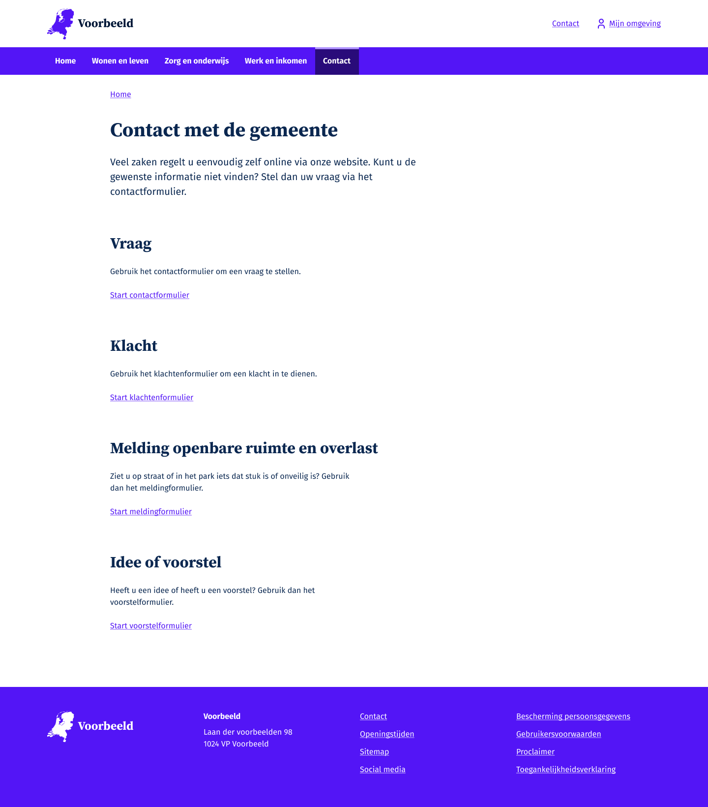

Figma ontwerp Scherm B:\
Uitleg over het formulier\
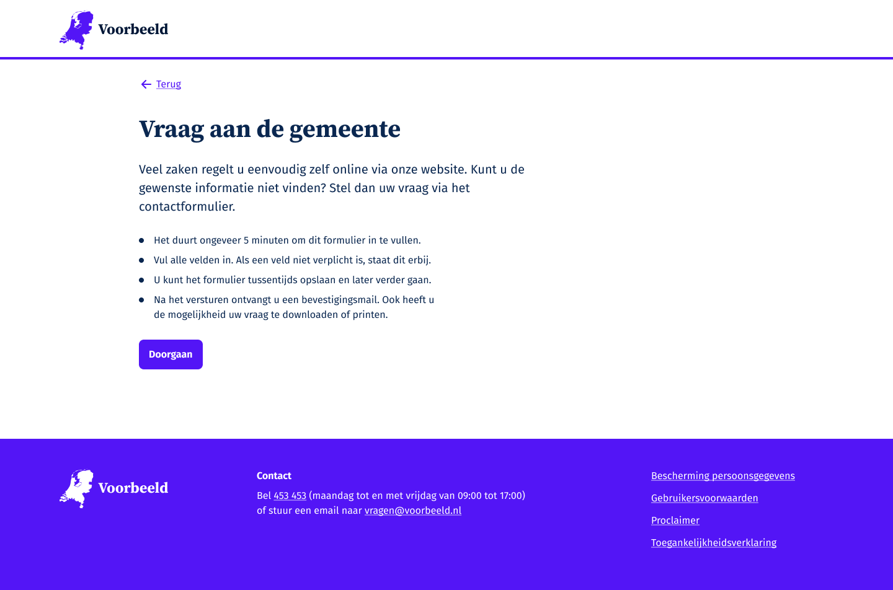

Figma ontwerp Scherm C:\
Inloggen ja of nee\
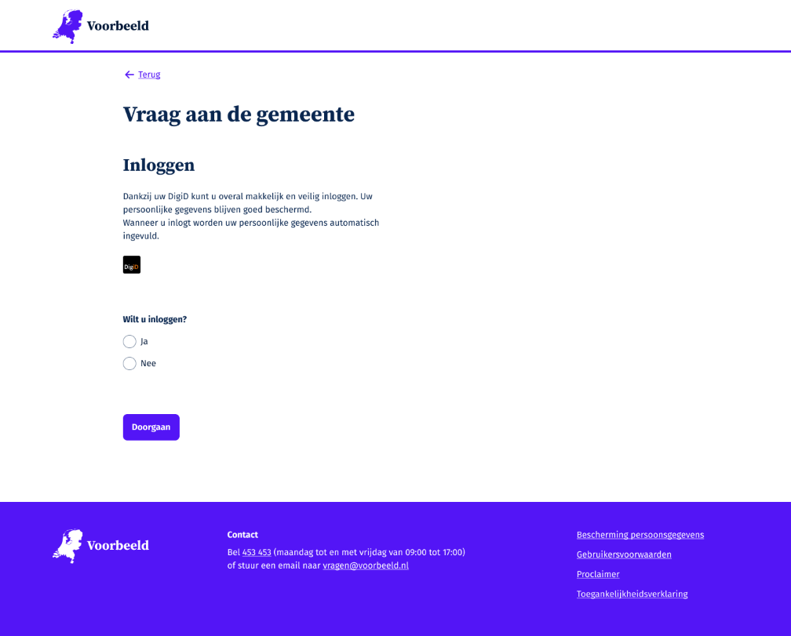

Figma ontwerp Scherm E stap 1:\
Uw vraag aan de gemeente\
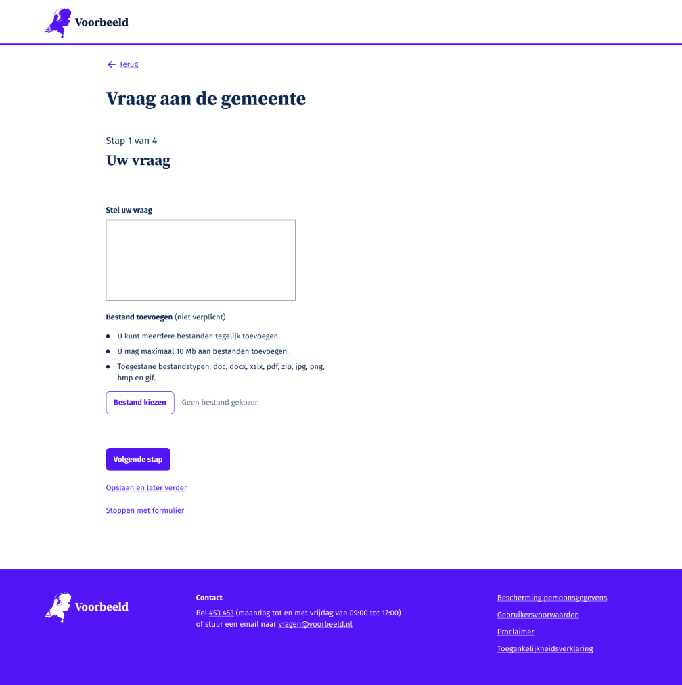

Figma ontwerp Scherm E stap 2:\
UW gegevens\
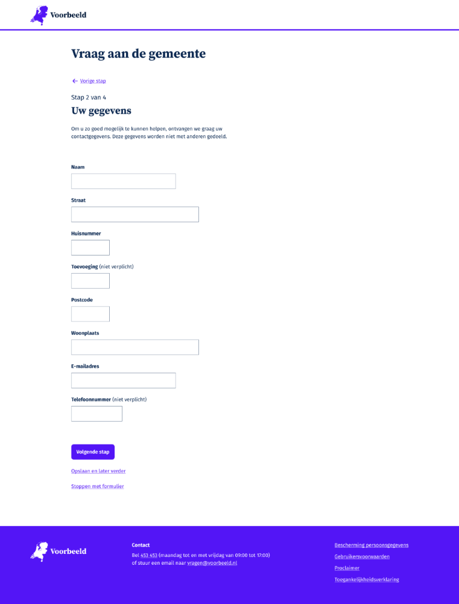

Figma ontwerp Scherm E stap 2 waarbij foutmeldingen zijn uitgewerkt:\
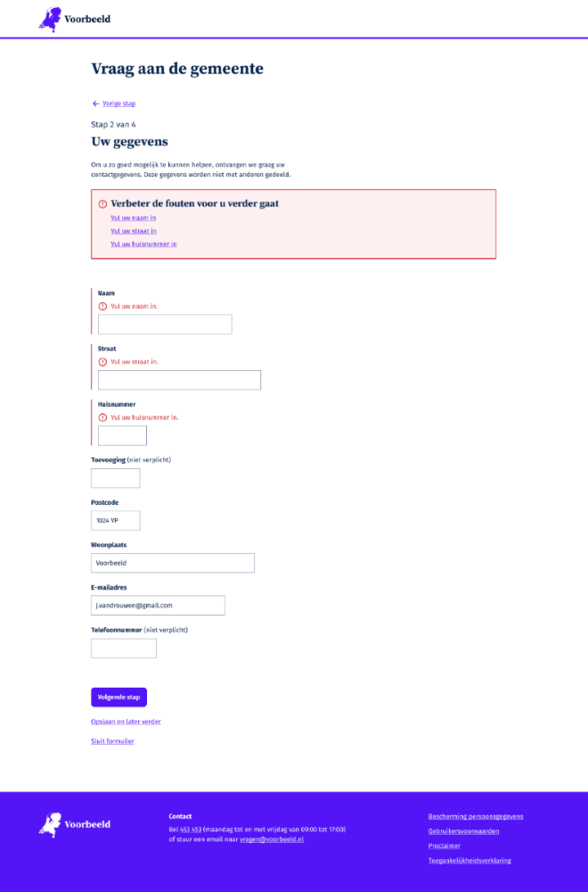

Figma ontwerp Scherm E stap 3:\
Controleer uw gegevens\
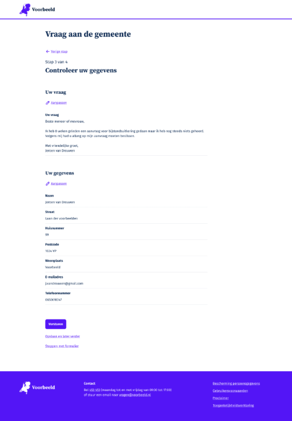

Figma ontwerp Scherm E stap 4:
Uw vraag is met succes verstuurd
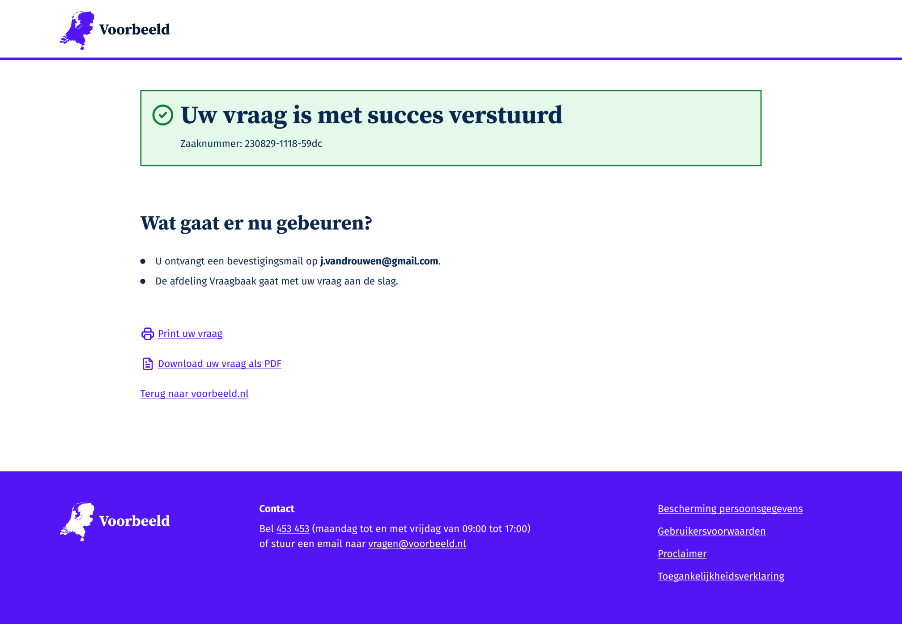

De volgende schermen zijn tijdens de usability test met behulp van Gmail en Figma gebruikt. In het kader van de tijd was het niet mogelijk een MijnOmgeving in code klaar te zetten, daarom is er gebruik gemaakt van een Figma scherm, die niet met een screen reader of anderszins op accessibility getest kan worden. Tijdens de Usability tests zijn deze schermen voorgelegd en toegelicht door de onderzoeker om op die manier nog waardevolle feedback te kunnen ontvangen.

Figma ontwerp schermen Gmail voor scenario E_kort:

Ontvangsbevestiging in de Inbox\
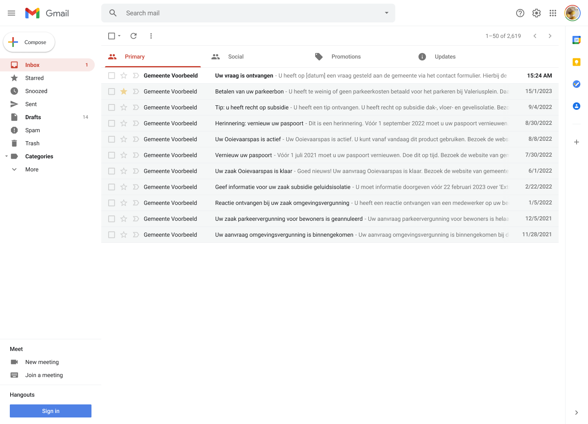

Ontvangsbevestiging inhoud emailtje\

Ontvangsbevestiging pdf met ingevulde gegevens\

Figma ontwerp schermen Gmail voor scenario E_lang:

Ontvangsbevestiging in de Inbox\

Ontvangsbevestiging inhoud emailtje\
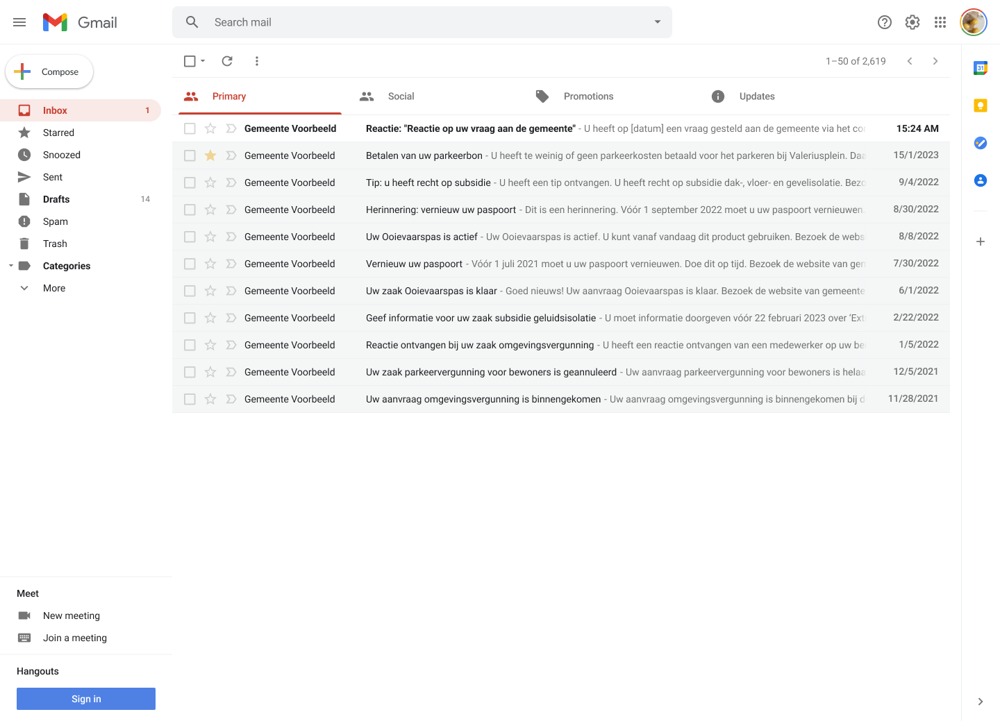

Mijn Omgeving Overzichtscherm\

Mijn Omgeving Mijn zaken overzicht\
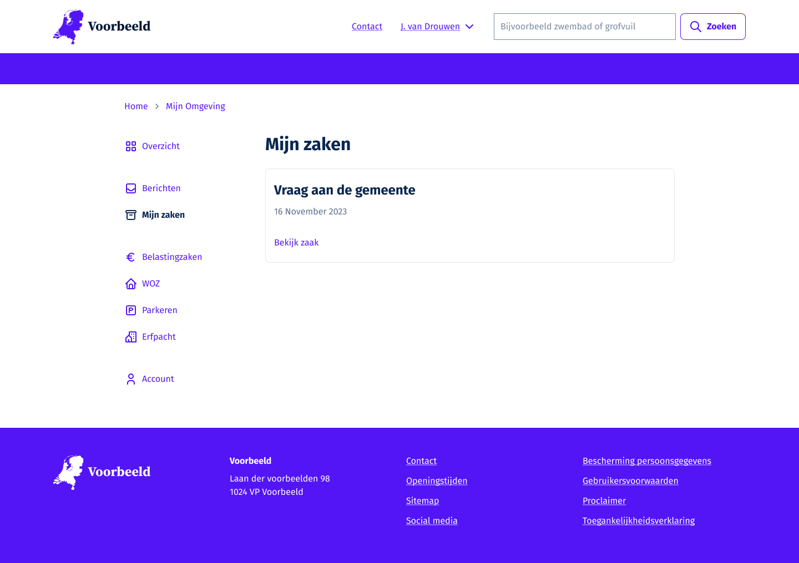

Mijn Omgeving Uw vraag aan de gemeente zaak\

Bekijk de [uitgewerkte ontwerpen in detail in Figma.](https://www.figma.com/file/iIr1gkAR3oZ0UFWKIni8Nv/VNG---WMEBV---Templates?type=design&node-id=315%3A89&mode=design&t=OlU3fZjF6snJQaPk-1)
